# Architecture

Top-level architecture for the template monorepo. This is the big-picture entry point; each
subsystem links out to a focused zoom-in doc under `docs/architecture/apps/*` and
`docs/architecture/platform/*`.

- **Infra provider**: Railway (compute, Postgres, Redis, pub/sub, queues, cron, storage) — single
  cloud; Redis runs as a self-hosted container in the same Railway project
- **Runtime**: Bun everywhere (runtime + package manager + bundler)
- **Tests**: Vitest across every workspace (node + jsdom + happy-dom environments as needed);
  Playwright for browser e2e; Detox / Maestro for mobile e2e
- **Language**: TypeScript strict, monorepo via Bun workspaces + Turborepo
- **Pattern**: Clean architecture per module — `entities/ports` → `infrastructure` →
  `dependency-injection`
- **Quality**: Biome (lint + format), Changesets (versioning), GitHub Actions (CI) → Railway deploy

---

## End-to-End System Diagram

One typed RPC call from any client hits `apps/api` directly on Railway, which resolves
platform-module ports out of the DI container and talks to Railway services and external SaaS.
Railway fronts every service with TLS, DNS, and a managed edge — no separate CDN / WAF layer in
front of it.

```mermaid
flowchart TB
    classDef client fill:#dbeafe,stroke:#1e3a8a,color:#0f172a
    classDef api fill:#dcfce7,stroke:#166534,color:#0f172a
    classDef module fill:#ede9fe,stroke:#5b21b6,color:#0f172a
    classDef rail fill:#fce7f3,stroke:#9d174d,color:#0f172a
    classDef saas fill:#e0f2fe,stroke:#075985,color:#0f172a

    subgraph Clients["Clients (apps/*)"]
        Website["apps/website<br/>Next.js 15 · MDX blog<br/>Tailwind v4 · Shadcn/ui<br/>:3002 · no auth"]
        Web["apps/web<br/>Next.js 15 · RSC + tRPC<br/>Tailwind v4 · Shadcn/ui<br/>@clerk/nextjs auth"]
        Mobile["apps/mobile<br/>Expo SDK 54 · NativeWind v4<br/>(Tailwind v3 pin)<br/>@clerk/clerk-expo · tRPC"]
        Desktop["apps/desktop<br/>electron-vite · React + TS<br/>@clerk/clerk-js · tRPC"]
    end

    subgraph API["apps/api"]
        Api["apps/api<br/>Bun · Hono · tRPC · Zod<br/>:3001 · composition root<br/>exports AppRouter type"]
    end

    subgraph Platform["Core Platform Modules (packages/*)"]
        Config["@t/config<br/>port: ConfigRepository<br/>impl: process.env + Zod"]
        Logging["@t/logging<br/>port: Logger<br/>impl: winston structured JSON"]
        Auth["@t/auth<br/>port: AuthRepository<br/>impl: Clerk (@clerk/backend)"]
        Db["@t/db<br/>port: DbClient<br/>impl: Drizzle ORM · Railway Postgres + pgvector"]
        Analytics["@t/analytics<br/>port: AnalyticsTracker<br/>impl: PostHog (server + client)"]
        Billing["@t/billing<br/>port: BillingRepository<br/>impl: RevenueCat (primary)<br/>Stripe (web processor, behind RC)"]
        Cache["@t/cache<br/>port: CacheClient<br/>impl: Redis (ioredis)"]
    end

    subgraph Rail["Railway Infra"]
        Pg["Postgres<br/>+ pgvector"]
        Redis["Redis<br/>self-hosted container<br/>cache · rate limit · pub/sub"]
        PubSub["Pub/Sub<br/>realtime fanout"]
        Queues["Queues<br/>durable jobs · retries · DLQ"]
        Cron["Cron<br/>scheduled jobs"]
        Storage["Storage<br/>objects · exports · backups"]
    end

    subgraph SaaS["External SaaS"]
        Clerk["Clerk<br/>identity + session JWTs<br/>free tier 10k MAU"]
        PostHog["PostHog<br/>product analytics"]
        RC["RevenueCat<br/>primary billing SDK for every app<br/>entitlements · paywalls · webhooks"]
        Stripe["Stripe<br/>payment processor behind RC<br/>(web payments only)"]
    end

    Website --> Api
    Web --> Api
    Mobile --> Api
    Desktop --> Api

    Api --> Config
    Api --> Logging
    Api --> Auth
    Api --> Db
    Api --> Analytics
    Api --> Billing
    Api --> Cache

    Db --> Pg
    Cache --> Redis
    Api --> PubSub
    Api --> Queues
    Api --> Cron
    Api --> Storage

    Analytics --> PostHog
    Billing --> RC
    RC --> Stripe
    Auth --> Clerk
    Clerk -. "user.* webhook" .-> Api

    Web -.-> Clerk
    Mobile -.-> Clerk
    Desktop -.-> Clerk

    Web -.-> RC
    Mobile -.-> RC
    Desktop -.-> RC

    class Website,Web,Mobile,Desktop client
    class Api api
    class Config,Logging,Auth,Db,Analytics,Billing,Cache module
    class Pg,Redis,PubSub,Queues,Cron,Storage rail
    class Clerk,PostHog,Stripe,RC saas
```



Dashed edges show the unified billing story: every client (web, mobile, desktop) uses the RevenueCat
SDK as the single billing / purchase layer, and RevenueCat is the source of truth for subscription
state via webhooks to `apps/api`. Stripe sits behind RevenueCat as the payment processor for web
payments only — there is no direct Stripe Checkout, Stripe Customer Portal, or `@stripe/stripe-js`
UI in any app. Mobile uses RevenueCat with native store IAP (Apple / Google) underneath; desktop
uses RevenueCat Web Billing. On the auth side, every client signs in through Clerk SDKs and sends
the Clerk-issued JWT as `Authorization: Bearer` on tRPC calls; Clerk posts `user.created` /
`user.updated` / `user.deleted` webhooks back to `apps/api`, which mirrors the minimal user row into
Railway Postgres via `@t/database`. All server-side entitlement truth flows through `@t/billing`
inside `apps/api`, sourced from RevenueCat.

---

## Module Shape

Every core capability in `packages/*` follows the same clean-architecture layout. The port is the
contract; the infra impl is swappable; the DI registration wires them up. App code depends only on
the port.

```text
packages/<module>/
├── entities/
│   ├── ports/                    abstract class / interface (the contract)
│   │   └── <Module>Repository.ts
│   ├── schemas/                  Zod schemas at the boundary
│   └── types/                    pure TS domain types, no runtime deps
├── infrastructure/
│   └── <Module>RepositoryImpl.ts one concrete impl per environment
├── dependency-injection/
│   └── register<Module>DI.ts     registers impl into the container
└── index.ts                      re-exports entities + infra + DI
```

**Rules:**

- App code imports only from `entities/` (the port); never from `infrastructure/`.
- Infra impls depend on third-party SDKs; ports do not.
- One port per module. Extra impls (e.g., in-memory for tests) live alongside the real impl in
  `infrastructure/`.
- `apps/api` is the composition root: it calls every `register<Module>DI` once and exposes the
  resulting procedures through the tRPC router.

Once two+ projects share the same impls, the abstract classes + bootstrap impls can be lifted into a
standalone `@nutraforge/platform` repo without changing app code — only the DI registration line
moves.

---

## Module Index

| Module          | Port                  | Bootstrap impl                         | Zoom-in                                     |
| --------------- | --------------------- | -------------------------------------- | ------------------------------------------- |
| `@t/dependency-injection` | — (foundation) | Awilix container + `dependencyKeys` + `lifetimeConfig` — imported by every `register*DI` | —                                 |
| `@t/config`     | `ConfigRepository`    | `process.env` + Zod per subsystem      | [platform/config.md](./platform/config.md)         |
| `@t/logging`    | `Logger`              | `winston` structured JSON              | [platform/logging.md](./platform/logging.md)       |
| `@t/auth`       | `AuthRepository`      | Clerk (`@clerk/backend` JWKS verify + webhook user sync) | [platform/auth.md](./platform/auth.md)             |
| `@t/db`         | `DbClient`            | Drizzle ORM · Railway Postgres + pgvector | [platform/database.md](./platform/database.md)              |
| `@t/analytics`  | `AnalyticsTracker`    | PostHog (Node SDK + client SDKs)       | [platform/analytics.md](./platform/analytics.md)   |
| `@t/billing`    | `BillingRepository`   | RevenueCat primary (all apps) · Stripe as web payment processor behind RC | [platform/billing.md](./platform/billing.md)       |
| `@t/cache`      | `CacheClient`         | `ioredis` against self-hosted Redis    | [platform/cache.md](./platform/cache.md)           |

> All platform zoom-in docs exist under `docs/architecture/platform/`. The module index above links
> each one.

---

## App Index

| App             | Stack                                                 | Role                          | Zoom-in                           |
| --------------- | ----------------------------------------------------- | ----------------------------- | --------------------------------- |
| `apps/website`  | Next.js 15 · MDX · Tailwind v4 · Shadcn/ui            | Marketing + blog, no auth     | [apps/website.md](./apps/website.md) |
| `apps/web`      | Next.js 15 · RSC + tRPC · Tailwind v4 · Shadcn/ui     | Product UI, Clerk auth (`@clerk/nextjs`) | [apps/web.md](./apps/web.md)         |
| `apps/mobile`   | Expo SDK 54 · NativeWind v4 (Tailwind v3) · tRPC      | iOS + Android, Clerk auth (`@clerk/clerk-expo`) | [apps/mobile.md](./apps/mobile.md)   |
| `apps/desktop`  | electron-vite · React + TS · tRPC                     | macOS + Windows, Clerk auth (`@clerk/clerk-js`) | [apps/desktop.md](./apps/desktop.md) |
| `apps/api`      | Bun · Hono · tRPC · Zod                               | HTTP entry + composition root | [apps/api.md](./apps/api.md)         |

---

## Long-Term Progress

Checklist tracks the whole roadmap. New scope → add a row, don't reflow existing ones.

### Monorepo & Delivery

- [x] Bun workspaces + Turborepo wired
- [x] Biome configured
- [x] Changesets configured
- [x] `railway.toml` declares `api` / `web` / `website`
- [x] GitHub Actions CI (lint + test on PRs)
- [x] Vitest adopted as the single test runner across every workspace (`vitest.config.ts` per
  package, `"test": "vitest run"`, root fans out via `turbo run test`) — standardized 2026-04-25
- [x] `apps/api/bunfig.toml` `[test]` preload retired in favour of Vitest `setupFiles`
- [ ] Add `postgres` service to `railway.toml`
- [ ] Add self-hosted `redis` service to `railway.toml` (bitnami/redis container, private
  networking, password from Railway var)
- [ ] Add worker service(s) for queue consumers
- [ ] GitHub Actions → Railway deploy per service (per-env)
- [ ] Preview environment per PR
- [ ] Turborepo remote cache enabled
- [x] `docs/architecture/ARCHITECTURE.md` kept in sync with reality (this file)

### `packages/config` (reference module)

- [x] `entities/ports/ConfigRepository.ts`
- [x] `entities/schemas/*` (system, auth, posthog, analytics, stripe, revenueCat, apple, android,
  gcp, logging, redis, db)
- [x] `infrastructure/ConfigRepositoryImpl.ts` (process.env reader)
- [x] `dependency-injection/registerConfigRepoDI.ts`
- [x] Drop `Auth0ConfigSchema` (Clerk migration)
- [x] Drop `GCPConfigSchema` — deleted 2026-04-26
- [x] `LoggingConfigSchema`, `AnalyticsConfigSchema` already exist; `BillingConfigSchema` not needed
  — billing covered by `RevenueCatConfigSchema` + `StripeConfigSchema`
- [x] Unit tests for each schema — 116 tests, 100% coverage (2026-04-26)
- [x] Drop `mongoUri`; `databaseUrl` on `DbConfigSchema` — done 2026-04-26
- [x] Replace `K_SERVICE` sentinel with `environment === ‘local’ || ‘development’` — done 2026-04-26
- [x] Add `RevenueCatConfigSchema.webhookAuthHeader` — done 2026-04-26
- [x] Doc: `docs/architecture/platform/config.md`
- [x] `packages/config/README.md` — created 2026-04-26

### `packages/logging`

- [x] `entities/ports/Logger.ts` — port with `debug / info / warn / error / fatal / child` +
  `warning` alias + `LogArg` / `LogPayload` types
- [x] `entities/enums/` — `LogLevel` + `LogType` enums (replaces separate schema file)
- [x] `infrastructure/winstonLogger.ts` — `WinstonLogger` base (winston v3, JSON in prod, ANSI
  pretty in dev); `GlobalLogger` + `RequestLogger` marker subclasses
- [x] `infrastructure/redactors.ts` — PII redaction format (default paths + `redactExtraPaths`)
- [x] `infrastructure/transports/` — PostHog OTLP-over-HTTP transport + singleton factory
  (env-gated; force-disabled under `ENVIRONMENT=testing`)
- [x] `dependency-injection/registerLoggerDI.ts` + `registerLoggerFactoryDI.ts`
- [x] Unit tests — 8 Vitest files covering log shape, level methods, redaction, child loggers, quiet
  mode, error serialization, legacy factories
- [x] Wired in `apps/api` composition root (`registerLoggerDI` + `registerLoggerFactoryDI` in
  `buildContainer()`)

### `packages/db`

- [x] `entities/ports/DbClient.ts` — `transaction / ping / close / raw`
- [x] `entities/ports/UserRepository.ts` + `EmbeddingStore.ts`
- [x] `entities/schemas/` — Drizzle table schemas (`users`, `embeddings` with pgvector HNSW cosine
  index)
- [x] `entities/types/` — `User`, `Embedding`, `VectorSearchResult`
- [x] `infrastructure/drizzle/` — `DrizzleDbClientImpl`, `DrizzleUserRepositoryImpl`,
  `DrizzleEmbeddingStoreImpl`
- [x] `infrastructure/in-memory/` — `InMemoryUserRepository`, `InMemoryEmbeddingStore` (test
  doubles)
- [x] `dependency-injection/registerDbDI.ts`
- [x] Migration tool chosen — drizzle-kit; migrations seeded (`0000_enable_pgvector.sql`,
  `0001_init_schema.sql` with `users.clerk_user_id UNIQUE`)
- [x] Wired in `apps/api` composition root (`registerDbDI` in `buildContainer()`)
- [ ] First migration applied against a live Postgres (infra task)
- [ ] Integration tests against ephemeral Railway Postgres
- [ ] `postgres` service added to `railway.toml`

### `packages/auth` (Clerk-backed)

- [x] `entities/ports/AuthProvider.ts` — `verify`, `currentUser`, `syncFromWebhook`
- [x] `entities/schemas/` — `AuthUserSchema`, `SessionClaimsSchema`, `WebhookEventSchema`
  (discriminated union over `user.created / updated / deleted`)
- [x] `entities/types/` — `AuthError` + `AuthErrorCode`, `AuthProviderOptions`, `UserSyncCallback`
- [x] `infrastructure/clerk/ClerkAuthProvider.ts` — `@clerk/backend` JWKS verify +
  `createClerkClient().users.getUser`
- [x] `infrastructure/noop/NoopAuthProvider.ts` — deterministic test double
- [x] `dependency-injection/registerAuthDI.ts`
- [x] Tests — Vitest; `ClerkAuthProvider`, `NoopAuthProvider`, `registerAuthDI`,
  `WebhookEventSchema` covered
- [x] `apps/api` middleware verifies Bearer JWT via `AuthProvider.currentUser`
  (`createClerkAuthMiddleware` mounted on `/trpc/*`)
- [x] `apps/api` `POST /api/webhooks/clerk` route (svix signature verify → `UserRepository` upsert /
  delete + `auth.syncFromWebhook`)
- [x] `apps/web` wired via `@clerk/nextjs` (`<ClerkProvider>`, `clerkMiddleware()`, sign-in /
  sign-up catch-alls, Bearer injection on tRPC)
- [x] `packages/db` migration adds `users.clerk_user_id TEXT NOT NULL UNIQUE` column + index
- [ ] `apps/mobile` wired via `@clerk/clerk-expo` (native Apple + Google sign-in, deep-link return,
  `tokenCache`)
- [ ] `apps/desktop` wired via `@clerk/clerk-js` (renderer provider + Bearer injection on tRPC
  links)

### `packages/analytics`

- [x] `entities/ports/AnalyticsTracker.ts` — 11-method surface (`capture / captureException /
  captureRevenue / captureLlm / identify / alias / group / sessionId / isFeatureEnabled /
  getAllFlags / shutdown`)
- [x] `entities/ports/RequestAnalyticsTracker.ts` — per-request wrapper port
- [x] `entities/schemas/EventSchema.ts` — Zod event shape
- [x] `entities/types/` — `Environment`, `Service`, `AnalyticsTrackerOptions`, `RevenueEvent`,
  `LlmEvent`, `ReservedSuperProps`
- [x] `infrastructure/PostHogAnalyticsTrackerImpl.ts` — posthog-node; constructor throws on missing
  `environment`/`service`; stamps `$environment`/`$service` super-props; strips reserved keys
- [x] `infrastructure/NoOpAnalyticsTracker.ts` — test/opt-out impl (same construction guard)
- [x] `infrastructure/RequestAnalyticsTrackerImpl.ts` — stamps `distinct_id`, `$session_id`,
  `request_id`, `$group`
- [x] `dependency-injection/registerAnalyticsDI.ts` — binds `dependencyKeys.global.ANALYTICS`
  singleton + `dependencyKeys.request.REQUEST_ANALYTICS` scoped
- [x] Tests — 6 Vitest files covering construction guard, NoOp, PostHog impl, request tracker, DI
  registrar, EventSchema
- [x] Wired in `apps/api` composition root (`registerAnalyticsDI` in `buildContainer()`)
- [ ] Privacy: PII scrub at the port layer (EU-launch prerequisite)
- [ ] `Environment` enum mismatch with `@t/config` resolved (current `as any` cast in
  `composition.ts`)
- [ ] UI SDK wiring (`posthog-js` in web / website / desktop; `posthog-react-native` in mobile)

### `packages/cache`

- [x] `entities/ports/CacheClient.ts` — `get / set / del / incr / withLock / publish / subscribe /
  close`
- [x] `entities/schemas/CacheKeySchema.ts` — Zod schema + `buildCacheKey({ env, module, id })`
- [x] `infrastructure/RedisCacheImpl.ts` — ioredis; atomic `INCR+EXPIRE` Lua; `SET NX PX` +
  CAS-release Lua `withLock`
- [x] `infrastructure/InMemoryCacheImpl.ts` — Map + setTimeout TTL; per-key promise-chain lock;
  in-process pub/sub
- [x] `dependency-injection/registerCacheDI.ts` — routes `testing` → in-memory, else → Redis
- [x] `RedisConfigSchema` added to `@t/config`
- [x] Distributed lock helper (`withLock`) — single-node Redlock-style; exposed from both impls
- [x] Wired in `apps/api` composition root (`registerCacheDI` in `buildContainer()`)
- [ ] Rate-limit middleware in `apps/api` consuming `incr(key, ttl)`
- [ ] Integration tests against an ephemeral Redis container in CI
- [ ] `redis` service added to `railway.toml`

### `packages/billing`

- [x] `entities/ports/BillingRepository.ts` — `createCheckoutSession / getEntitlements /
  handleStripeEvent / handleRevenueCatEvent / syncEntitlement`
- [x] `entities/schemas/` — `CustomerSchema`, `SubscriptionSchema`, `EntitlementSchema`,
  `WebhookEventSchema`
- [x] `infrastructure/RevenueCatBillingImpl.ts` — primary impl (REST via fetch); source of truth for
  entitlements
- [x] Stripe is configured **inside RevenueCat** as the web payment processor — no separate Stripe
  billing surface is exposed to app code
- [x] `infrastructure/webhookVerifier.ts` — `verifyRevenueCatWebhook` (timing-safe header compare)
- [x] `dependency-injection/registerBillingDI.ts` — binds `dependencyKeys.global.BILLING_REPOSITORY`
- [x] Wired in `apps/api` composition root (`registerBillingDI` in `buildContainer()`)
- [x] RevenueCat webhook handler in `apps/api` (`POST /api/webhooks/revenuecat`) with signature
  verification
- [ ] Idempotency tests; `billing_events` table (blocked on `@t/db` `BillingEventRepository`)
- [ ] `syncEntitlement` persistence (currently logs only)
- [ ] `StripeBillingImpl` + `CompositeBillingImpl` collapsed behind RevenueCat (scaffold-era; to
  retire)

### `apps/api`

- [x] tRPC + Hono scaffold
- [x] `/health` endpoint
- [x] Router tests — 96/96 Vitest tests at 100% statement/branch/function/line coverage
  (standardized 2026-04-25)
- [x] DI container bootstraps all 10 modules (`src/composition.ts#buildContainer()` — Config,
  Logger, LoggerFactory, Cache, DB, Auth, Billing, Analytics, UserRepository, EmbeddingStore)
- [x] Composition root test (`src/composition.test.ts`) asserts every `dependencyKeys.global` token
  resolves
- [x] Clerk auth middleware (`createClerkAuthMiddleware`) mounted on `/trpc/*`; tRPC context exposes
  `userId`, `user`
- [x] `POST /api/webhooks/clerk` — svix verify + UserRepository persistence + `auth.syncFromWebhook`
- [x] `POST /api/webhooks/revenuecat` — shared-secret verify +
  `billingRepository.handleRevenueCatEvent`
- [x] `@t/errors` `errorHandler` mounted via `app.onError`
- [ ] Each router procedure ported onto `ctx.db` typed repositories (currently throws
  `NOT_IMPLEMENTED` — pending domain models from `@t/db`)
- [ ] `process.on('unhandledRejection')` wired
- [ ] Per-request `RequestLogger` / `requestId` middleware
- [ ] CORS origin list moved to `ConfigRepository` (currently hard-coded)
- [ ] Queue consumer entrypoint (separate Railway service)
- [ ] Cron entrypoint (scheduled job invokers)
- [ ] Pub/Sub publisher helpers
- [ ] OpenAPI emitted from tRPC for external consumers

### `apps/web` (product UI)

- [x] Next.js 15 App Router + RSC
- [x] Tailwind v4 + Shadcn/ui
- [x] tRPC client wired
- [x] Playwright scaffold (`playwright.config.ts`)
- [x] `@clerk/nextjs` wired (`<ClerkProvider>`, `clerkMiddleware()`, sign-in / sign-up catch-alls,
  Bearer injection on tRPC) — done 2026-04-25
- [ ] Auth UI backed by `@t/auth` port (server-side verification via `@clerk/backend` through the
  port)
- [ ] Analytics wrapper using `@t/analytics` port
- [ ] Error boundary → `@t/logging`
- [ ] Playwright e2e covers login / dashboard / paywall (RevenueCat Web SDK)

### `apps/website` (marketing)

- [x] Next.js 15 + MDX
- [ ] Blog index / tag routes
- [ ] `/api/health` hooked into Railway healthcheck
- [ ] SEO: sitemap, robots, OG images
- [ ] Analytics port wired (pageviews only)

### `apps/mobile`

- [x] Expo SDK 54 + NativeWind v4 (Tailwind v3 pin)
- [ ] `@clerk/clerk-expo` wired (`<ClerkProvider>`, `tokenCache` via `expo-secure-store`)
- [ ] Native Sign in with Apple (`expo-apple-authentication` + Clerk Apple strategy)
- [ ] Native Sign in with Google (Expo AuthSession + Clerk Google strategy)
- [ ] Auth flow wired to `@t/auth` port
- [ ] Deep links for Clerk OAuth return (`template://clerk`) + billing return URLs
- [ ] Push notifications via Expo + queue consumer
- [ ] OTA updates via EAS
- [ ] Store submission pipelines

### `apps/desktop`

- [x] `electron-vite` + React
- [ ] `@clerk/clerk-js` wired in renderer (`<ClerkProvider>`, Bearer injection on tRPC links)
- [ ] Auto-update channel
- [ ] Code-signing (macOS + Windows)
- [ ] Crash reporter → `@t/logging`

### Infra on Railway

- [ ] Postgres service provisioned with `pgvector` enabled
- [ ] Redis service provisioned (self-hosted container, private networking only, AUTH password,
  appendonly persistence on)
- [ ] Pub/Sub topics declared per domain event
- [ ] Queue names declared per job type
- [ ] Cron jobs declared in `railway.toml`
- [ ] Storage bucket + signed-URL helper
- [ ] Per-environment secrets (development / production; staging removed from env model 2026-04-26)

### Legal (blockers before EU launch)

- [ ] Privacy policy / ToS
- [ ] Cookie consent banner
- [ ] GDPR / data-residency plan per market

### Future Platform Extraction

- [ ] Once two projects share `analytics`, `billing`, `auth`, `logging`, `config` impls,
      extract abstract classes + bootstrap impls into `@nutraforge/platform`.
- [ ] App code keeps importing the port; only the DI registration line changes at swap time.
