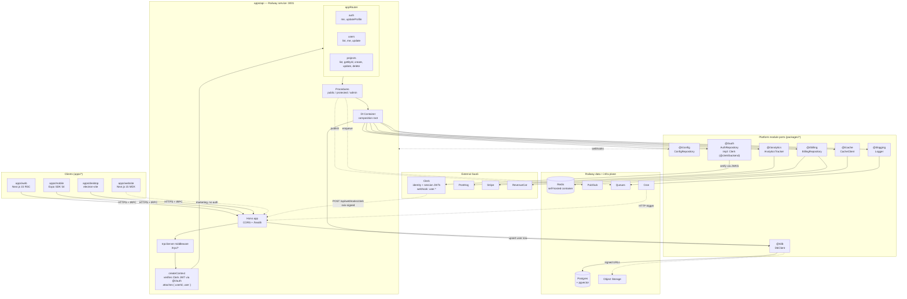

# apps/api

> **Template scaffolding.** Auth uses Clerk (`@clerk/backend`) via the `@t/auth` port; `@t/db`
> (Drizzle) is the sole DB surface. Projects consuming this template must configure their own Clerk
> credentials (`CLERK_PUBLISHABLE_KEY`, `CLERK_SECRET_KEY`, `CLERK_WEBHOOK_SECRET`).

Bun-native HTTP entrypoint and composition root for the monorepo. Hono serves CORS + `/health`,
`@hono/trpc-server` mounts the tRPC router at `/trpc/*`, and Zod guards every boundary. Runs on port
`3001` as a Railway service (Railway terminates TLS and fronts the public DNS — no separate CDN /
WAF), exports `AppRouter` for `apps/web`, `apps/mobile`, and `apps/desktop` to consume as a typed
client, and is the one place where every `@t/*` platform module is wired into a single DI container
before being handed to procedure handlers.

---

## High-Level Architecture



---

## File Layout

```text
apps/api/
├── vitest.config.ts                test runner config (vitest, node env, setupFiles)
├── package.json                    @t/api, exports AppRouter types
├── tsconfig.json
└── src/
    ├── index.ts                    Hono app — calls buildContainer() once,
    │                                installProcessHandlers(container),
    │                                app.onError(errorHandler), CORS,
    │                                request-context middleware, /health,
    │                                /api/webhooks/{clerk,revenuecat},
    │                                clerkAuth (/trpc/*), /trpc/* mount
    ├── composition.ts              buildContainer(): Container — single
    │                                composition root, registers all 10 DI tokens
    ├── composition.test.ts         vitest smoke test — every dependencyKeys.global
    │                                token resolves under ENVIRONMENT=testing
    ├── lifecycle.ts                installProcessHandlers(container) —
    │                                process.on('unhandledRejection' |
    │                                'uncaughtException') → analytics.captureException
    ├── middleware/
    │   ├── clerkAuth.ts            createClerkAuthMiddleware(container) —
    │   │                           Bearer → c.var.userId / c.var.user
    │   └── request-context.ts      createRequestContextMiddleware(container) —
    │                               requestId / logger / analytics on Hono ctx,
    │                               echoes X-Request-ID
    ├── routes/
    │   └── webhooks/clerk.ts       svix verify (CLERK_WEBHOOK_SECRET) +
    │                               AuthProvider.syncFromWebhook(event)
    ├── trpc/
    │   ├── index.ts                initTRPC, router, publicProcedure,
    │   │                           protectedProcedure, adminProcedure
    │   └── context.ts              createContext(opts, container) — resolves
    │                               db, cache, logger, auth, analytics,
    │                               requestAnalytics off the container
    ├── routers/
    │   ├── index.ts                appRouter = { auth, users, projects }
    │   ├── auth.ts                 me, updateProfile
    │   ├── users.ts                list, me, update
    │   ├── projects.ts             list, getById, create, update, delete
    │   └── __tests__/
    │       └── users.test.ts       vitest, appRouter.createCaller(mockCtx)
    └── __tests__/
        └── setup.ts                preloads dummy CLERK_* + billing env vars
```

---

## Module Wiring

Each platform module exports a `register*DI` function from
`packages/<module>/dependency-injection/`. The composition root in `apps/api/src/composition.ts`
(`buildContainer()`) is the single place they are all called, in dependency order. `src/index.ts`
invokes `buildContainer()` once at boot, then hands the container to `createContext` for per-request
resolution.

| Platform module    | Port                 | DI registration fn        | Current status in apps/api |
| --- | --- | --- | --- |
| `@t/config`        | `ConfigRepository`   | `registerConfigRepo`      | Wired (step 1) |
| `@t/logging`       | `Logger`             | `registerLoggerFactoryDI` + `registerLoggerDI` | Wired (step 2) |
| `@t/cache`         | `CacheClient`        | `registerCacheDI`         | Wired (step 3); in-memory under `environment === 'testing'` |
| `@t/db`            | `DbClient`           | `registerDbDI`            | Wired (step 3); intentionally unbound under `environment === 'testing'` (in-memory `USER_REPOSITORY` + `EMBEDDING_STORE` instead) |
| `@t/auth`          | `AuthProvider`       | `registerAuthDI`          | Wired (step 3); Clerk-backed (`@clerk/backend` JWKS verify); noop under testing/missing-key. Middleware + `/api/webhooks/clerk` route mounted on Hono |
| `@t/analytics`     | `AnalyticsTracker`   | `registerAnalyticsDI`     | Wired (step 3) |
| `@t/billing`       | `BillingRepository`  | `registerBillingDI`       | Wired (step 4); guarded with try/catch — consumer supplies Stripe + RevenueCat env vars; absence logs a warning rather than crashing the scaffold |

Order matters: `config` -> `logger factory` -> `logger` -> `cache` / `db` / `auth` / `analytics` ->
`billing`. Later modules pull their settings from `ConfigRepository` and emit via `Logger`, so those
must register first. The smoke test `apps/api/src/composition.test.ts` asserts every
`dependencyKeys.global` token resolves under `ENVIRONMENT=testing` (with `DB` documented as the
deliberate exception).

### Per-request shape

Shape under DI + Clerk (as of 2026-04-26):

- `ctx.config` — validated env per subsystem (includes Clerk keys)
- `ctx.logger` — resolved from the container; per-request child logger + correlation id is a
  follow-up
- `ctx.userId` / `ctx.user` — populated upstream by the `clerkAuth` Hono middleware
  (`apps/api/src/middleware/clerkAuth.ts`) before tRPC runs. The middleware reads `Authorization:
  Bearer <jwt>`, calls `AuthRepository.currentUser(token)`, and writes `c.var.userId` /
  `c.var.user`. tRPC `createContext` consumes `c.var` on the fast path; falls back to in-context
  Bearer verification when the Hono context isn't reachable (test paths). The middleware never
  throws — downstream procedures gate access.
- `ctx.auth` — `AuthRepository` (Clerk impl) resolved from the container
- `ctx.db` — `DbClient` with `query` / `transaction`
- `ctx.analytics` / `ctx.requestAnalytics` — server tracker + per-request scope
- `ctx.cache` — get/set/del, rate-limit helpers, distributed lock via withLock

Procedure guards: `publicProcedure` for anonymous reads, `protectedProcedure` throws `UNAUTHORIZED`
when `ctx.user` is null, and `adminProcedure` extends it with a `role === 'admin'` check against the
Clerk session claim (`publicMetadata.role`).

### Auth flow at a glance

```text
Hono request
   │
   ▼
app.onError(errorHandler)         ← @t/errors
   │
   ▼
CORS  →  /health  →  /api/webhooks/{clerk,revenuecat}     ← provider-signed; no Bearer
   │
   ▼
/trpc/* → createClerkAuthMiddleware(container)            ← reads Bearer, writes c.var.userId / c.var.user
   │
   ▼
trpcServer({ createContext })
   │
   ▼
createContext reads c.var (fast path) ─┐
                                       ▼
                         protectedProcedure / adminProcedure gate on ctx.userId / ctx.user.role
```

### Clerk middleware + webhook routes

Clerk is the identity provider; `apps/api` only verifies tokens and receives webhook user-sync
events. Nothing about Clerk leaks into router code — procedures depend only on `AuthRepository`.
Webhook signature semantics (Clerk svix + RevenueCat shared-secret) are documented in
`docs/architecture/webhooks.md`.

- **Middleware (`apps/api/src/middleware/clerkAuth.ts`).** Exported as
  `createClerkAuthMiddleware(container)`. Mounted on `/trpc/*` only. Reads `Authorization: Bearer
  <clerk-session-jwt>`, calls `AuthRepository.currentUser(token)` (which wraps `@clerk/backend`
  `verifyToken` + JWKS), and sets `c.var.userId` / `c.var.user`. Token-less requests proceed with
  `userId = null` / `user = null`; `protectedProcedure` enforces non-null. Never throws.
- **Webhook (`POST /api/webhooks/clerk`, `apps/api/src/routes/webhooks/clerk.ts`).** Exports
  `createClerkWebhookApp(container)`. Sits outside the tRPC mount (raw body required for svix).
  Flow:
  1. Read raw body before any JSON parser runs.
  2. Verify signature with `svix.Webhook(CLERK_WEBHOOK_SECRET)` over `svix-id` / `svix-timestamp` /
     `svix-signature` headers. (svix is used directly — we did not swap to
     `@clerk/backend/webhooks`.)
  3. Parse event with `WebhookEventSchema` (Zod).
  4. Persist via `UserRepository.create` (on `user.created`), `findByClerkUserId` + `update` (on
     `user.updated`), or `findByClerkUserId` + `delete` (on `user.deleted`), then call
     `AuthRepository.syncFromWebhook(event)`.
  5. Return `200` on success. Repository / sync errors return `500` so svix retries; signature
     failures return `401`.
- **Webhook (`POST /api/webhooks/revenuecat`, `apps/api/src/routes/webhooks/revenuecat.ts`).**
  Exports `createRevenueCatWebhookApp(container)`. RevenueCat does not sign with HMAC — it sends a
  static shared-secret value in the `Authorization` header. Flow:
  1. Verify via `verifyRevenueCatWebhook` from `@t/billing` (timing-safe compare against
     `config.revenueCat.webhookAuthHeader`).
  2. Parse with `RevenueCatWebhookEventSchema` from `@t/billing`.
  3. Dispatch via `billingRepository.handleRevenueCatEvent(event)`.
  4. `200 / 400 / 401 / 500` per failure mode.

### Billing wiring status (2026-04-26)

`@t/billing` composition-root wiring is complete:

- `dependencyKeys.global.BILLING_REPOSITORY` hoisted (2026-04-24).
- `RevenueCatConfigSchema.webhookAuthHeader` added to `@t/config` (2026-04-26); `apps/api` reads
  `config.revenueCat.webhookAuthHeader` (no bare `process.env`).
- `registerBillingDI({ stripeConfig, revenuecatConfig, revenuecatWebhookAuthHeader })` called in
  `buildContainer()`. *Caveat:* still uses `asFunction`, so config errors only surface at resolve
  time.
- `POST /api/webhooks/revenuecat` mounted (`apps/api/src/routes/webhooks/revenuecat.ts`). The
  scaffold-era `POST /api/webhooks/stripe` is **not** part of the target architecture — Stripe
  events surface through RevenueCat's webhook stream.

Open follow-up: real `billing_events(provider, event_id, processed_at)` idempotency table +
entitlement writes once `@t/db` exposes a `BillingEventRepository`. Today `syncEntitlement` is a
logging stub in `RevenueCatBillingImpl`.

---

## Worker & Cron

`apps/api` runs as **three independent Bun processes**, all sharing the same composition root
(`buildContainer()`) and DI container, deployed as **three separate Railway services** off the same
repo:

| Service | Entrypoint | Script | Lifetime | Railway shape |
| --- | --- | --- | --- | --- |
| HTTP | `apps/api/src/index.ts` | `bun run dev` (dev) / `bun run start` (prod) | long-running | autorestart service, public DNS |
| Worker | `apps/api/src/worker.ts` | `bun run worker` (prod) / `bun run worker:dev` (dev — `bun run --watch`) | long-running | autorestart service, no public DNS |
| Cron | `apps/api/src/cron.ts` | `bun run cron` | one-shot | Railway cron service, run on schedule |

All three boot off the same `buildContainer()` — there is no separate "worker container" or "cron
container". Each entrypoint resolves only the tokens it needs (worker pulls `QUEUE` + `LOGGER`; cron
pulls `QUEUE` + `LOGGER`; HTTP pulls everything). Adding a new entrypoint means a new top-level
`src/<name>.ts` file plus a new script in `apps/api/package.json`, **not** a new container.

### Worker (`apps/api/src/worker.ts`)

Long-running Bun process. The boot sequence is deliberately tiny:

```ts
const container = buildContainer()
installProcessHandlers(container)   // unhandledRejection / uncaughtException / SIGTERM / SIGINT
registerJobHandlers(container)      // queue.registerHandler('ping', ...); queue.registerHandler('heartbeat', ...)
const logger = container.resolve<Logger>(dependencyKeys.global.LOGGER)
logger.info('Worker ready and listening for jobs.')
```

Once `registerJobHandlers` returns, the BullMQ `Worker` (constructed inside
`BullMQQueueClientImpl`'s constructor) is already polling Redis and dispatching jobs to the
registered handlers. There is no explicit "start" call — registration **is** subscription. The
process stays alive on the BullMQ worker's open Redis connection until SIGTERM/SIGINT, at which
point `installProcessHandlers` `await`s `queue.close()` before `shutdownLogging()` and
`process.exit(0)`.

### Cron (`apps/api/src/cron.ts`)

One-shot Bun process, designed to be invoked by Railway's cron service on a schedule:

```ts
const container = buildContainer()
const queue = container.resolve<QueueClient>(dependencyKeys.global.QUEUE)
const logger = container.resolve<Logger>(dependencyKeys.global.LOGGER)
await queue.enqueue('heartbeat', {})   // placeholder until repeat-job scheduling lands
await queue.close()
process.exit(0)
```

Today it enqueues a single `'heartbeat'` job and exits — a placeholder pattern, not the long-term
shape. The `QueueClient` port does not yet expose a `repeat` option, so true cron-driven recurring
work cannot be expressed through the port. When the port grows (or a sibling `enqueueRepeating(name,
payload, cronExpr)` method is added — see `docs/architecture/platform/queue.md` § Open Items),
`cron.ts` becomes the single place where Railway-scheduled invocations register repeat jobs against
BullMQ.

### Job handlers

Handlers live in `apps/api/src/jobs/handlers/`. Each handler is a typed factory function returning
an `async (payload) => void`:

```ts
// apps/api/src/jobs/handlers/pingHandler.ts
export interface PingPayload { message: string }
export function pingHandler(logger: Logger) {
  return async (payload: PingPayload): Promise<void> => {
    logger.info({ message: 'Worker received ping job', metadata: { payload } })
  }
}
```

Registration is centralised in `apps/api/src/jobs/registerJobHandlers.ts`:

```ts
export function registerJobHandlers(container: Container): void {
  const queue = container.resolve<QueueClient>(dependencyKeys.global.QUEUE)
  const logger = container.resolve<Logger>(dependencyKeys.global.LOGGER)
  queue.registerHandler('ping', pingHandler(logger))
  queue.registerHandler('heartbeat', heartbeatHandler(logger))
}
```

**To add a new job handler:**

1. Add `apps/api/src/jobs/handlers/<name>Handler.ts` exporting `<name>Handler(deps): (payload) =>
   Promise<void>`.
2. Add a `queue.registerHandler('<name>', <name>Handler(...))` line to `registerJobHandlers.ts`.
3. Producers (tRPC procedures, cron entrypoint, other services) call `queue.enqueue('<name>',
   payload)`.

The handler factory pattern (closure over `logger` / other DI tokens) keeps handlers
pure-function-shaped and trivially mockable in tests, while still letting them depend on
container-resolved services.

---

## Bootstrap Status

Mirrors the `apps/api` slice of [root ARCHITECTURE.md § Long-Term
Progress](../ARCHITECTURE.md#long-term-progress). Verified against source.

- [x] `@t/errors` consumer wiring complete (2026-04-26): `app.onError(errorHandler)` mounted,
  `apps/api/src/middleware/request-context.ts` produces `requestId` / child logger / request-scoped
  analytics on Hono context, `apps/api/src/lifecycle.ts` (`installProcessHandlers`) registers
  `process.on('unhandledRejection' | 'uncaughtException')`. Echoes `X-Request-ID`. Tests 96 → 129
  (+33) at 100% cov.
- [x] tRPC + Hono scaffold
- [x] `/health` endpoint
- [x] Router tests scaffolded (`apps/api/src/__tests__/`, `routers/__tests__/`)
- [x] DI container bootstraps all platform modules (`buildContainer()` in `src/composition.ts`)
- [x] `@t/config` wired via `registerConfigRepo` (step 1 of the composition root)
- [x] `@t/logging` wired via `registerLoggerFactoryDI` + `registerLoggerDI`; `app.onError` emits via
  the resolved logger (no more `console.error`)
- [x] `@t/auth` wired via `registerAuthDI` — Clerk middleware + `/api/webhooks/clerk` route mounted;
  consuming projects supply Clerk credentials
- [x] `@t/db` wired via `registerDbDI` (in-memory under `environment === 'testing'`; postgres.js
  impl against Railway Postgres in non-testing)
- [x] `@t/analytics` wired via `registerAnalyticsDI`
- [x] `@t/billing` wired via `registerBillingDI` (try/catch guard — consumer supplies Stripe +
  RevenueCat env vars)
- [x] `@t/cache` wired via `registerCacheDI` (ioredis against self-hosted Redis container in
  production; in-memory under testing)
- [x] `composition.test.ts` smoke test asserts every `dependencyKeys.global` token resolves under
  `ENVIRONMENT=testing`
- [x] Test runner standardized on vitest; `apps/api/bunfig.toml` retired
- [ ] Each router procedure depends only on ports (no direct SDK references) — context is fully
  port-driven; legacy SDK-shaped reads in routers still being purged
- [ ] Healthcheck probes Postgres / Redis / pub-sub / queue reachability
- [ ] CORS origins sourced from `ConfigRepository` (remove hard-coded dev URLs)
- [x] Queue consumer entrypoint (separate Railway service) — `apps/api/src/worker.ts` (2026-04-28,
  commit `3aa4b61`)
- [x] Cron entrypoint (scheduled job invokers) — `apps/api/src/cron.ts` (2026-04-28, commit
  `3aa4b61`); repeat-job scheduling still pending (`QueueClient` port has no `repeat` option yet)
- [ ] Pub/Sub publisher helpers
- [ ] OpenAPI emitted from tRPC for external consumers
- [ ] Playwright smoke suite run against production after each main-branch deploy
- [ ] `users.test.ts` fixed (currently asserts non-existent `users.getCurrentUser`)

---

## Open Items

Inspected from the actual source tree as of this revision.

- **DI container built.** `apps/api/src/composition.ts` (`buildContainer()`) wires all 10
  `dependencyKeys.global` tokens via 8 registrars. `src/index.ts` calls it once at boot;
  `src/trpc/context.ts` resolves ports per-request. Smoke-tested by `src/composition.test.ts`.
- **Routers throw `NOT_IMPLEMENTED`.** Confirmed clean of Supabase residue (2026-04-26). Routers
  (`auth.ts`, `users.ts`, `projects.ts`) intentionally throw `NOT_IMPLEMENTED` pending domain models
  from `@t/db`. Port them onto `ctx.db` (Drizzle-backed `DbClient`) + `UserRepository` /
  `EmbeddingStore` once `@t/db` exposes the repositories.
- **Analytics / billing hooks pending.** Mutations do not emit events or check entitlements yet —
  ports are wired, integration sites are not.
- ~~**No worker / cron entrypoints.**~~ **Resolved 2026-04-28** (commit `3aa4b61`) —
  `apps/api/src/worker.ts` (long-running consumer; `bun run worker` / `bun run worker:dev`) and
  `apps/api/src/cron.ts` (one-shot scheduler; `bun run cron`) now ship alongside
  `src/jobs/registerJobHandlers.ts` + `src/jobs/handlers/{ping,heartbeat}Handler.ts`. SIGTERM/SIGINT
  handler in `src/lifecycle.ts` awaits `queue.close()` before `shutdownLogging()`. See § Worker &
  Cron below and `docs/architecture/platform/queue.md`.
- **No OpenAPI emission.** `AppRouter` is TypeScript-only; no `/openapi.json` is served for non-tRPC
  consumers.
- **Healthcheck is minimal.** `/health` returns `{ status: 'ok', timestamp }` without verifying
  Postgres, pub/sub, or queue reachability.
- **CORS origins are dev-only.** `http://localhost:3000` and `http://localhost:8081` are hard-coded;
  production origins must move into `ConfigRepository`.
- **`SessionUser` + `readBearerToken` duplication.** Both are defined in
  `apps/api/src/middleware/clerkAuth.ts` and `apps/api/src/trpc/context.ts`. Extract to a shared
  file (e.g. `apps/api/src/trpc/sessionUser.ts`) in a small follow-up — pure refactor, no behavior
  change.
- ~~**`process.on('unhandledRejection')` not registered.**~~ **Resolved 2026-04-26** —
  `apps/api/src/lifecycle.ts` exports `installProcessHandlers(container)`, called from
  `apps/api/src/index.ts` after `buildContainer()`. Registers both
  `process.on('unhandledRejection')` and `process.on('uncaughtException')`; uses the global
  `AnalyticsTracker.captureException(error, 'system', { source })` (process-level events have no
  user context, so the explicit `'system'` distinctId is intentional).
- **Per-request `requestId` / child logger / request-scoped analytics on Hono context.**
  `apps/api/src/middleware/request-context.ts` (NEW 2026-04-26) is mounted as `app.use('*',
  createRequestContextMiddleware(container))` after CORS and before health/webhooks/auth/tRPC.
  Generates `requestId` via `crypto.randomUUID()`, builds child logger via `createGlobalLogger({
  requestId, metadata: { method, path } })`, resolves request-scoped analytics via
  `container.createScope()` registering `{ parent, requestId, userId? }`. Sets `requestId`,
  `logger`, `analytics` on Hono context (consumed by `@t/errors` `errorHandler` via `c.get(...)`).
  Echoes `X-Request-ID` response header.
