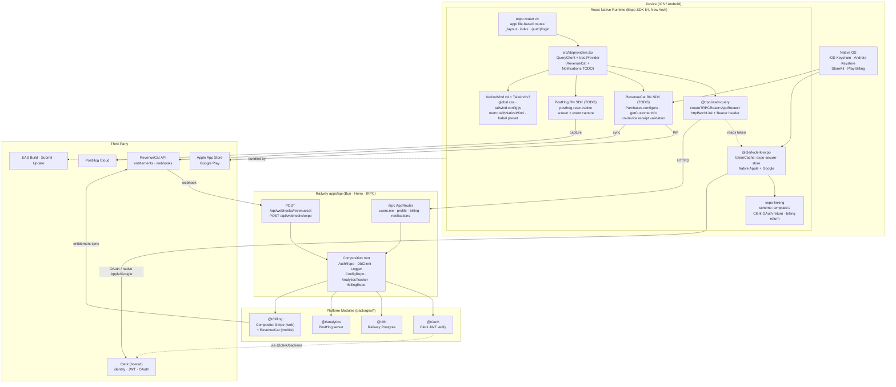

<!-- last_audited: 2026-04-26 -->

# apps/mobile

> **Template scaffolding.** Auth uses Clerk via `@clerk/clerk-expo` with `expo-secure-store` as the
> token cache. Projects consuming this template must configure their own Clerk credentials
> (`EXPO_PUBLIC_CLERK_PUBLISHABLE_KEY`).

Expo SDK 54 React Native client for the template monorepo. File-based routing via expo-router,
NativeWind v4 styling pinned to Tailwind v3 (web and website run Tailwind v4 — mobile cannot follow
until NativeWind v5 ships), **Clerk** auth via `@clerk/clerk-expo` with native Sign in with Apple +
native Sign in with Google (Expo AuthSession + Clerk strategies), a typed tRPC v11 client consuming
`apps/api`'s `AppRouter` export, RevenueCat for native in-app purchases (distinct from Stripe used
on web/desktop), and PostHog React Native for analytics. Ships to the App Store and Play Store via
EAS Build / Submit with EAS Update OTA channels.

## High-Level Architecture



## File Layout

```text
apps/mobile/
├── app/                          expo-router file-based routes
│   ├── _layout.tsx              RootLayout, wraps <Providers>, Stack nav
│   ├── index.tsx                HomeScreen: session gate + trpc.users.me
│   └── (auth)/
│       └── login.tsx            Clerk <SignIn /> or <SignUp /> via @clerk/clerk-expo
├── src/
│   └── lib/
│       ├── providers.tsx        QueryClient + trpc.Provider + Bearer header
│       ├── clerk.ts             create Clerk with expo-secure-store token cache
│       └── trpc.ts              createTRPCReact<AppRouter> + getTrpcUrl()
├── assets/                      icon · splash · adaptive-icon · favicon
├── app.json                     Expo config (scheme: template, bundleIds,
│                                plugins: expo-router, expo-secure-store,
│                                expo-apple-authentication (if Apple sign-in required),
│                                newArchEnabled: true, typedRoutes)
├── babel.config.js              babel-preset-expo + nativewind/babel
├── metro.config.js              withNativeWind + monorepo watchFolders
├── tailwind.config.js           Tailwind v3 + nativewind/preset
├── global.css                   @tailwind directives
├── nativewind-env.d.ts          className typings
├── expo-env.d.ts                Expo module typings
├── tsconfig.json                strict, jsx: react-native, nativewind/types
├── package.json                 expo ~54 · nativewind ^4.1 · tailwindcss ^3.4
│                                @trpc/* ^11 · @clerk/clerk-expo ^5
└── README.md
```

## Platform Integration Matrix

| Concern            | Mobile implementation                                                                       | Port (when wired)        |
| --- | --- | --- |
| Auth token storage | `@clerk/clerk-expo` with `tokenCache` backed by `expo-secure-store` → iOS Keychain / Android Keystore | `@t/auth`         |
| Session / identity | `@clerk/clerk-expo` (`useAuth`, `useUser`, `useClerk`) — Clerk handles refresh and OAuth | `@t/auth`         |
| Native sign-in     | `expo-apple-authentication` (Apple) + `expo-auth-session` (Google) via Clerk strategies  | `@t/auth`         |
| API transport      | `@trpc/react-query` `httpBatchLink` → `EXPO_PUBLIC_API_URL` with `Authorization: Bearer` | `AppRouter` type import  |
| Billing / IAP      | RevenueCat RN SDK on device + App Store / Play Billing; server sync via webhook            | `@t/billing` (RC) |
| Web/desktop billing| (for contrast) Stripe Checkout + webhook — not used on mobile                              | `@t/billing` (Stripe) |
| Analytics          | `posthog-react-native` (capture + screen views), opt-in per GDPR                            | `@t/analytics`    |
| Styling            | NativeWind v4 (`className` on RN primitives) over Tailwind v3 — pinned until NW v5        | n/a (build-time)         |
| Navigation         | expo-router v4, typed routes, `(auth)` group for unauthenticated stack                      | n/a                      |
| Deep links         | `expo-linking`, scheme `template://` (Clerk OAuth return, billing receipt)                  | n/a                      |
| Build / release    | EAS Build (dev/preview/prod), EAS Submit, EAS Update channels                                | n/a                      |

Tailwind v3 pin rationale: NativeWind v4 generates RN StyleSheet from Tailwind v3 AST output.
Tailwind v4's redesigned engine breaks that pipeline. Unification to v4 waits on NativeWind v5
(planned 2026). Keep `tailwindcss` at `^3.4.0` in `apps/mobile/package.json`; do not bump alongside
web/website upgrades.

## Request Flow (users.me)

```text
HomeScreen mounts
  useAuth() → { isSignedIn, userId }   ← Clerk session (token cache: expo-secure-store)
  hasSession === true
    trpc.users.me.useQuery()                        → providers.tsx httpBatchLink
    headers: { authorization: 'Bearer <clerk-jwt>' }
  POST https://<EXPO_PUBLIC_API_URL>/users.me
    Railway apps/api
      AuthRepository.verify(token)                  → @clerk/backend verifyToken + JWKS
      DbClient.query(select from users where clerk_user_id=?)
      BillingRepo.checkEntitlement(userId)          → RevenueCat-synced entitlement row
      Logger.info('users.me', { userId })
  response: { id, email, isPremium }                 React Query cache → UI render
```

## Bootstrap Status

Mirrors the `apps/mobile` slice of [root ARCHITECTURE.md § Long-Term
Progress](../ARCHITECTURE.md#long-term-progress).

- [x] Expo SDK 54 scaffold
- [x] NativeWind v4 + Tailwind v3 pin
- [x] `@clerk/clerk-expo` installed and wired: `<ClerkProvider>` in `_layout.tsx`, `useAuth()` /
  `useUser()` hooks, sign-in / sign-up via Clerk components or Clerk-hosted UI *(2026-04-26 —
  `<ClerkProvider>` + `tokenCache` (expo-secure-store) mounted in `_layout.tsx`; `useAuth()`-driven
  session gate)*
- [x] Native Sign in with Apple: `expo-apple-authentication` + Clerk Apple strategy configured in
  Clerk dashboard *(2026-04-26 — `useSignInWithApple` hook)*
- [ ] Native Sign in with Google: `expo-auth-session` (starts the OAuth flow) + Clerk Google
  strategy (completes it via deep-link return)
- [x] Deep-link handler: `template://clerk` registered in `app.json` →
  `Linking.parseInitialURLAsync()` → Clerk `handleRedirect*` on the return leg *(2026-04-26 —
  `template://` scheme declared in `app.json`)*
- [x] tRPC `httpBatchLink` injects `Authorization: Bearer ${await getToken()}` on every request
  (Clerk's per-request session token) *(2026-04-26 — Bearer attach landed; covered by unit test)*
- [ ] Auth flow wired to `@t/auth` port (Clerk JWT verify, webhook sync)
- [ ] RevenueCat SDK installed + `Purchases.configure` called
- [ ] RevenueCat webhook handler in `apps/api` (`POST /api/webhooks/revenuecat`)
- [ ] PostHog React Native SDK installed + screen capture
- [ ] Push notifications via `expo-notifications` + Expo Push API worker
- [ ] EAS config (`eas.json`) with dev / preview / production profiles
- [ ] OTA updates via EAS Update
- [ ] Store submission pipelines (App Store Connect, Play Console)
- [ ] Vitest + `@testing-library/react-native` unit tests
- [ ] Detox or Maestro device e2e
- [ ] Platform SDK TODOs resolved in `providers.tsx` / `trpc.ts`

## Open Items

- **Platform SDK wiring** — `providers.tsx` and `trpc.ts` carry TODOs to mount
  `@nutraforgetechnologies/billing` (RevenueCat provider + paywall),
  `@nutraforgetechnologies/notifications` (Expo push token registration + NotificationsProvider),
  and `@nutraforgetechnologies/ai` (streaming chat client) once the Platform SDK is extracted.
- **RevenueCat integration** — SDK install, `Purchases.configure`, offerings/paywall UI, webhook
  handler on `apps/api` (`POST /api/webhooks/revenuecat`), entitlement sync into Railway Postgres.
- **PostHog RN SDK** — install `posthog-react-native`, init in `providers.tsx`, identify on auth
  state change, screen capture via expo-router hook.
- **Push notifications** — `expo-notifications` token registration, Android channel setup, queue
  consumer (Railway worker) calling Expo Push API, `notifications.subscribe` tRPC procedure to
  persist tokens.
- **Deep links** — register `template://clerk` in `app.json` as the scheme; on app launch,
  `Linking.parseInitialURLAsync()` routes the Clerk OAuth redirect to Clerk's deep-link handler.
  Billing receipt return goes to `template://receipt`.
- **Routes** — `(billing)/` stack (paywall, manage subscription, receipt) and `(settings)/` stack
  (profile, preferences, biometric unlock via `expo-local-authentication`).
- **Auth via `@t/auth` port** — server-side verification through `@clerk/backend`;
  web/mobile/desktop share the same contract. Consuming projects supply their own Clerk credentials
  and wire `@clerk/clerk-expo` in the renderer.
