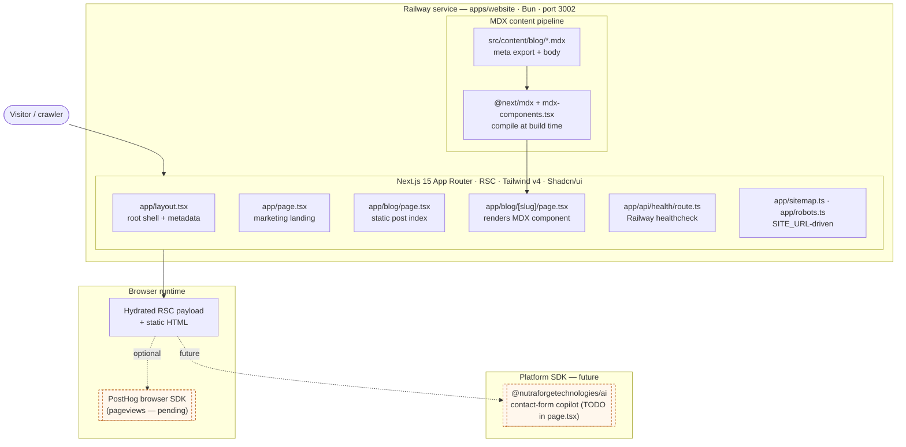

# apps/website

Unauthenticated marketing site and MDX blog. The simplest app in the monorepo — Next.js 15 App
Router with Tailwind v4 and Shadcn/ui conventions, no auth, no tRPC, no database. Content is pure
static pages plus MDX files compiled at build time via `@next/mdx`. Runs on port `3002` as its own
Railway service, with a `/api/health` endpoint for Railway healthchecks and a hook point for a
lightweight analytics client (PostHog pageviews) once the `@t/analytics` port is wired.

## High-Level Architecture



Traffic hits the single Next.js service on Railway directly (Railway fronts TLS + public DNS) and is
served as RSC-rendered HTML plus static MDX-compiled blog posts. No upstream calls to `apps/api`, no
database, no session. The only runtime branch is `SITE_URL` env flowing into `sitemap.ts` /
`robots.ts`. `@t/config` is a declared dep but unused in live code paths today.

## File Layout

```text
apps/website/
├── next.config.ts              # withMDX(nextConfig), pageExtensions incl. md/mdx
├── mdx-components.tsx          # useMDXComponents() — passthrough, ready for overrides
├── postcss.config.mjs          # @tailwindcss/postcss v4
├── tsconfig.json
├── package.json                # @t/website · next dev -p 3002
└── src/
    ├── app/
    │   ├── layout.tsx          # RootLayout + <Metadata>
    │   ├── page.tsx            # "Template Website" landing (TODO: Platform SDK)
    │   ├── globals.css         # Tailwind v4 entry
    │   ├── robots.ts           # MetadataRoute.Robots
    │   ├── sitemap.ts          # MetadataRoute.Sitemap
    │   ├── api/health/route.ts # GET → { status: 'ok' }
    │   └── blog/
    │       ├── page.tsx        # hard-coded posts[] index
    │       └── [slug]/page.tsx # imports MDX component + meta
    ├── content/
    │   └── blog/
    │       └── hello-world.mdx # `export const meta` + body
    └── types/
        └── mdx.d.ts            # module shim for .mdx imports
```

## Content Model

| Route                 | Rendering  | Source                                                | Notes                                                     |
| --- | --- | --- | --- |
| `/`                   | Static RSC | `src/app/page.tsx` (static TSX)                       | Landing; hardcoded copy + two CTA links                   |
| `/blog`               | Static RSC | `src/app/blog/page.tsx` (inline `posts[]` array)      | Index is NOT derived from filesystem yet                  |
| `/blog/[slug]`        | SSG        | `src/content/blog/<slug>.mdx` via `@next/mdx` import  | `generateStaticParams` from hardcoded map; MDX → RSC      |
| `/api/health`         | Route      | `src/app/api/health/route.ts`                         | `GET → { status: 'ok' }`, Railway healthcheck target      |
| `/sitemap.xml`        | Metadata   | `src/app/sitemap.ts`                                  | Driven by `SITE_URL` env, lists `/` and `/blog`           |
| `/robots.txt`         | Metadata   | `src/app/robots.ts`                                   | Allow-all; points at `${SITE_URL}/sitemap.xml`            |

MDX pipeline: each post exports `const meta = { title, description, date }` plus the body.
`[slug]/page.tsx` imports `Component` + `meta` from the `.mdx` module and renders inside a `prose`
article. `next.config.ts` wires `@next/mdx` via `withMDX({})` and registers `md`/`mdx` in
`pageExtensions`; `mdx-components.tsx` is a passthrough `useMDXComponents` ready for Shadcn-styled
element overrides. No frontmatter parser, no filesystem-driven content collection, and no syntax
highlighter are wired yet — adding a new post today requires touching both `blog/page.tsx` and
`blog/[slug]/page.tsx`.

## Bootstrap Status

Mirrors the `apps/website` slice of [root ARCHITECTURE.md Section Long-Term
Progress](../ARCHITECTURE.md#long-term-progress).

- [x] Next.js 15 App Router + MDX via `@next/mdx`
- [x] Tailwind v4 via `@tailwindcss/postcss`
- [x] Landing page + sample blog post on disk
- [x] `sitemap.xml` + `robots.txt` routes
- [x] `/api/health` route exists
- [ ] `/api/health` hooked into `railway.toml` healthcheck
- [x] Filesystem-driven blog content collection (gray-matter, Zod, sorted by date)
- [x] Frontmatter + remark-gfm + rehype-pretty-code + shiki
- [ ] Blog tag routes + pagination (future)
- [x] SEO polish: per-page metadata, OG images, JSON-LD BlogPosting, canonical URLs
- [x] Shadcn CSS variables (full token set matching apps/web)
- [ ] `@t/analytics` port wired (pageviews only)
- [ ] `@t/config` import replaces direct `process.env.SITE_URL` reads
- [ ] Platform SDK hook (contact-form copilot, future)

## Open Items

Scaffolded but not finished — tracked here until each lands:

- **Content collection** — replace the hardcoded `posts[]` in `/blog` and the slug map in
  `[slug]/page.tsx` with a filesystem-driven collection (glob `src/content/blog/*.mdx`, extract
  `meta`, sort by date). Needed before more than one post exists.
- **Frontmatter / MDX plumbing** — add `gray-matter` (or keep `export const meta`), `remark-gfm`,
  `rehype-slug`, `rehype-autolink-headings`, and `rehype-pretty-code` / `shiki` for syntax
  highlighting. `mdx-components.tsx` is a passthrough today.
- **Tag / category routes** — `/blog/tags/[tag]` not scaffolded; requires content collection first.
- **OG images** — per-post Open Graph image generation via `next/og` not wired; `layout.tsx` has
  minimal metadata only.
- **SEO polish** — `SITE_URL` defaults to `https://example.com`; must be set per Railway
  environment. Canonical URL and per-page `<Metadata>` (titles/descriptions) not applied on `/`,
  `/blog`, or `/blog/[slug]`.
- **Analytics** — PostHog pageviews not mounted. Pending `@t/analytics` port + browser adapter so
  the marketing site uses the same tracker contract as `apps/web`.
- **Shadcn/ui** — declared as the UI convention; no components installed yet. Current pages use raw
  Tailwind utilities and a few `bg-primary` / `text-muted-foreground` tokens that assume the Shadcn
  CSS variables (not defined in `globals.css` yet).
- **Platform SDK hook** — `src/app/page.tsx` carries a `TODO: import from
  @nutraforgetechnologies/ai` for a marketing-site chatbot / contact-form copilot, blocked on the
  Platform SDK extraction.
- **`@t/config`** — listed as a dep but not imported; once `SITE_URL` and analytics keys have Zod
  schemas, read them through `ConfigRepository` instead of `process.env` directly.
- **Healthcheck wiring** — `/api/health` exists but is not yet declared as the Railway healthcheck
  path for the `website` service in `railway.toml`.
