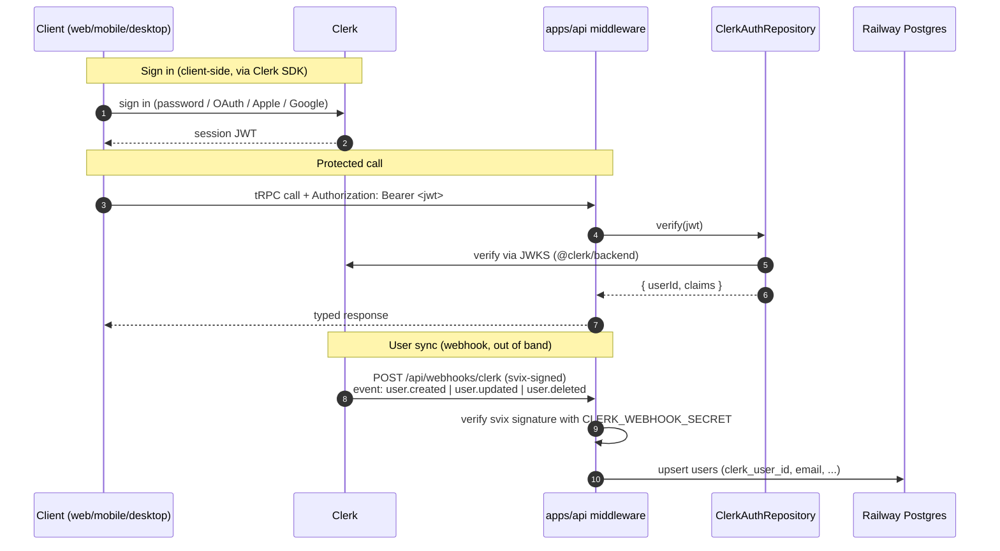

# @t/auth

> **Template scaffolding.** `@t/auth` provides a `ClerkAuthProvider` (server-side JWT verification
> via `@clerk/backend`) plus a `NoopAuthProvider` test double and a DI registrar. Apps consuming
> this template are responsible for wiring their own Clerk client SDKs (`@clerk/nextjs`,
> `@clerk/clerk-expo`, `@clerk/clerk-js`) with their own project credentials.

Platform auth module. Authentication is delegated to **Clerk** (hosted, free tier 10k MAU).
`apps/api` verifies Clerk-issued JWTs against Clerk's JWKS; clients sign in through Clerk SDKs; a
Clerk webhook mirrors the minimal user record into Railway Postgres via `@t/db`. App code depends
only on the port in `entities/ports/`; the Clerk impl plugs in at the composition root, and a
test-double impl is swapped in for unit tests. Swapping providers costs one DI registration line.

---

## High-Level Architecture

```mermaid
flowchart TB
    subgraph Clients["Clients (apps/*)"]
        direction LR
        WEB["apps/web<br/>Next.js 15<br/>@clerk/nextjs"]
        MOB["apps/mobile<br/>Expo SDK 54<br/>@clerk/clerk-expo"]
        DSK["apps/desktop<br/>Electron<br/>@clerk/clerk-js"]
        WST["apps/website<br/>no auth"]
    end

    subgraph Api["apps/api (Bun + Hono + tRPC · Railway service)"]
        direction TB
        MW["clerkAuthMiddleware<br/>reads Authorization: Bearer <clerk-jwt><br/>verifies via @clerk/backend + JWKS"]
        CTX["tRPC context<br/>attaches { userId, user } from verified claims"]
        HOOK["POST /api/webhooks/clerk<br/>user.created · user.updated · user.deleted<br/>svix signature verified"]
        PROC["procedures<br/>call AuthRepository methods"]
        MW --> CTX --> PROC
    end

    subgraph AuthPkg["packages/auth (@t/auth)"]
        direction TB
        PORT["entities/ports<br/>AuthRepository (abstract)"]
        SCHEMAS["entities/schemas<br/>AuthUser · SessionClaims"]
        IMPL["infrastructure<br/>ClerkAuthRepository (real)<br/>InMemoryAuthRepository (test double)"]
        DI["dependency-injection<br/>registerAuthDI"]
        PORT -. contract .-> IMPL
        SCHEMAS -. validates .-> IMPL
        DI -. binds .-> IMPL
    end

    subgraph Clerk["Clerk (hosted)"]
        CIssue["JWT issuer<br/>+ JWKS"]
        CHooks["Webhooks<br/>user.created · user.updated · user.deleted"]
    end

    subgraph Data["Railway Postgres (@t/db)"]
        UT[("users<br/>id · clerk_user_id (unique) · email · created_at · updated_at")]
    end

    WEB -->|"Authorization: Bearer <jwt>"| MW
    MOB -->|"Authorization: Bearer <jwt>"| MW
    DSK -->|"Authorization: Bearer <jwt>"| MW
    WST --> MW

    PROC --> PORT
    IMPL -->|verifyToken(token, { jwksUrl })| CIssue
    CHooks -->|POST signed event| HOOK
    HOOK -->|upsert / delete user row| UT

    WEB -->|sign in / up| CIssue
    MOB -->|native Apple / Google| CIssue
    DSK -->|sign in / up| CIssue

    DI -. wires on boot .-> Api
```

### Request paths, at a glance



---

## File Layout

`packages/auth/` target layout (Clerk-backed):

```text
packages/auth/
├── package.json                         // @t/auth, type: module, workspace
├── tsconfig.json
├── src/
│   ├── entities/
│   │   ├── ports/
│   │   │   └── AuthRepository.ts        // abstract class: verify, currentUser, syncFromWebhook
│   │   ├── schemas/
│   │   │   ├── AuthUserSchema.ts
│   │   │   ├── SessionClaimsSchema.ts
│   │   │   ├── WebhookEventSchema.ts
│   │   │   └── index.ts
│   │   └── types/
│   │       ├── AuthUser.ts
│   │       ├── SessionClaims.ts
│   │       ├── AuthError.ts             // AuthError + AuthErrorCode
│   │       └── index.ts
│   ├── infrastructure/
│   │   ├── ClerkAuthRepository.ts       // @clerk/backend verifyToken + JWKS
│   │   └── InMemoryAuthRepository.ts    // test double: deterministic verify
│   ├── dependency-injection/
│   │   └── registerAuthDI.ts            // AUTH_DI_KEY = 'auth' (local const)
│   └── index.ts                         // re-export entities + DI
```

> Implementation note: `ClerkAuthRepository` wraps `@clerk/backend`'s `verifyToken` (JWKS-cached,
> network-free on the hot path after warm-up). It never issues tokens — that is entirely Clerk's
> job. The port stays provider-agnostic: no Clerk types leak out of `infrastructure/`.

---

## Ports & Impls

| Port (entities/ports) | Impl (infrastructure) | DI registrar |
| --- | --- | --- |
| `AuthRepository` | `ClerkAuthRepository` (real, `@clerk/backend` + JWKS) | `registerAuthDI(container, opts)` |
| `AuthRepository` | `InMemoryAuthRepository` (unit-test double — deterministic `verify`, configurable claims) | test setup only |

`AuthRepository` contract:

| Method | Returns | Notes |
| --- | --- | --- |
| `verify(token)` | `AuthUser` | Validates a Clerk-issued JWT against Clerk's JWKS; throws `AuthError` on expired / tampered / missing |
| `currentUser(token)` | `AuthUser \| null` | Convenience for tRPC context — catches `AuthError` and returns `null` |
| `syncFromWebhook(event)` | `void` | Called by the webhook route after svix signature verification — upserts / deletes the mirrored user row |

The port intentionally **does not** expose `register` / `login` / `refresh` / `logout`: Clerk owns
the credential + session lifecycle on the client side via its SDKs. `apps/api` only consumes tokens.

---

## Env Vars

Validated by `AuthConfigSchema` in `packages/config/entities/schemas/AuthConfigSchema.ts`
(re-exported from `packages/config/entities/schemas/index.ts`).

| Variable | Default | Purpose |
| --- | --- | --- |
| `CLERK_PUBLISHABLE_KEY` | — (required) | Client-side publishable key; consumed by `apps/web`, `apps/mobile`, `apps/desktop` for SDK init. Safe to expose to the browser / bundle. |
| `CLERK_SECRET_KEY` | — (required, server-only) | Server-side key used by `@clerk/backend` in `apps/api` for JWKS init + Clerk Backend API calls. **Never** ship to clients. |
| `CLERK_WEBHOOK_SECRET` | — (required, server-only) | svix signing secret used by `apps/api` to verify `/api/webhooks/clerk` payloads. |

Client apps use the publishable key under the framework-specific env var name expected by each Clerk
SDK (`NEXT_PUBLIC_CLERK_PUBLISHABLE_KEY`, `EXPO_PUBLIC_CLERK_PUBLISHABLE_KEY`,
`VITE_CLERK_PUBLISHABLE_KEY`). Those are pass-throughs — single source of truth stays in
`@t/config`.

---

## DI Registration

`registerAuthDI` binds the `AuthProvider` impl under `dependencyKeys.global.AUTH` (the `AUTH_DI_KEY`
local const aliases this hoisted token).

```ts
import { registerAuthDI, AUTH_DI_KEY } from '@t/auth';

registerAuthDI(container, {
  config,            // AuthConfig — clerkSecretKey, clerkPublishableKey, clerkWebhookSecret
  environment,       // 'development' | 'local' | 'testing' | 'production'
  logger,            // optional @t/logging Logger
  userSync,          // optional UserSyncCallback — bridges webhook events to UserRepository writes
});

const auth = container.resolve(AUTH_DI_KEY);
const user = await auth.verify(bearerToken);
```

Test setup swaps the impl:

```ts
container.register({ [AUTH_DI_KEY]: asValue(new InMemoryAuthRepository({ userId: 'u_test' })) });
```

## Composition Root (apps/api)

`apps/api/src/composition.ts#buildContainer()` wires `registerAuthDI` and constructs the `userSync`
callback that bridges Clerk webhook events into `UserRepository` writes. The callback is built
inside the composition root so the auth package never imports `@t/db`.

```ts
// apps/api/src/composition.ts (illustrative shape)
registerAuthDI(container, {
  config,
  environment,
  userSync: async (event) => {
    // lazy resolve so registration order doesn't matter
    const userRepo = container.resolve(dependencyKeys.global.USER_REPOSITORY);
    switch (event.type) {
      case 'user.created':
        return userRepo.create({ clerkUserId: event.data.id, email: event.data.email_addresses?.[0]?.email_address });
      case 'user.updated': {
        const existing = await userRepo.findByClerkUserId(event.data.id);
        if (existing) return userRepo.update(existing.id, { /* mapped fields */ });
        return userRepo.create({ clerkUserId: event.data.id, email: event.data.email_addresses?.[0]?.email_address });
      }
      case 'user.deleted': {
        const existing = await userRepo.findByClerkUserId(event.data.id);
        if (existing) return userRepo.delete(existing.id);
        return;
      }
    }
  },
});
```

Key invariants:

- `userSync` lazily resolves `USER_REPOSITORY` so the auth registrar can run before the db
  registrar.
- `auth.syncFromWebhook(event)` (called by the webhook route) invokes this callback under the hood;
  the route never touches `UserRepository` directly through the auth port.
- The webhook route (`apps/api/src/routes/webhooks/clerk.ts`) ALSO calls `UserRepository` directly
  today for explicit per-event handling, plus `auth.syncFromWebhook(event)` for provider
  bookkeeping. Both paths are idempotent (upsert by `clerk_user_id`) so svix retries are safe.

---

## Middleware Pattern (apps/api)

Hono middleware sits in front of the tRPC mount. **Wired 2026-04-26.**

- **Factory location:** `apps/api/src/middleware/clerkAuth.ts` exports `createClerkAuthMiddleware(container): MiddlewareHandler<{ Variables: { userId: string | null; user: SessionUser | null } }>`.
- **Mount point:** `app.use('/trpc/*', createClerkAuthMiddleware(container))` in
  `apps/api/src/index.ts`. Mount order is: `onError(errorHandler)` → CORS → `/health` →
  `/api/webhooks/clerk` + `/api/webhooks/revenuecat` → `clerkAuth` on `/trpc/*` → tRPC server.
- **Behavior:** non-blocking. Reads `Authorization: Bearer <jwt>`, calls `auth.currentUser(bearer)`,
  populates `c.var.userId` + `c.var.user`. Never throws — downstream tRPC procedures gate
  authorization (`protectedProcedure`, `adminProcedure`).
- **Webhook routes are mounted before `clerkAuth`** so the svix signature is the auth surface for
  those routes (no Bearer needed).

```ts
// apps/api/src/middleware/clerkAuth.ts  (shape, illustrative)
export const createClerkAuthMiddleware = (container: Container): MiddlewareHandler => async (c, next) => {
  const auth = container.resolve(dependencyKeys.global.AUTH);
  const bearer = c.req.header('authorization')?.replace(/^Bearer\s+/i, '');
  const user = bearer ? await auth.currentUser(bearer) : null;
  c.set('userId', user?.userId ?? null);
  c.set('user', user);
  await next();
};
```

- `publicProcedure` — no check; `ctx.user` may be `null`.
- `protectedProcedure` — throws tRPC `UNAUTHORIZED` when `ctx.user == null`.
- `adminProcedure` — `protectedProcedure` + checks a Clerk public-metadata `role === 'admin'` claim
  on the session token.

JWKS caching is handled inside `@clerk/backend`; the module fetches once and re-fetches on key
rotation.

The tRPC context (`apps/api/src/trpc/context.ts`) consumes `c.var.userId` / `c.var.user` on the fast
path, falling back to in-context Bearer verification when the Hono context isn't reachable
(test-only paths).

---

## Webhook Sync (Clerk → Railway Postgres)

Clerk emits `user.created`, `user.updated`, `user.deleted` events. A dedicated route outside the
tRPC mount receives them (raw body is required for svix signature verification). **Wired
2026-04-26.**

- **Route:** `POST /api/webhooks/clerk` (the on-disk path is `/api/webhooks/clerk`; older docs may
  use the shorthand `/webhooks/clerk`).
- **Mount point:** `apps/api/src/index.ts` mounts the webhook app **before** the `clerkAuth`
  middleware so the svix signature is the auth — no Bearer is required.
- **Handler file:** `apps/api/src/routes/webhooks/clerk.ts` exports
  `createClerkWebhookApp(container)`.
- **Secret:** `CLERK_WEBHOOK_SECRET` is resolved from
  `container.resolve(CONFIG).auth.clerkWebhookSecret` with `process.env.CLERK_WEBHOOK_SECRET` as a
  fallback (used by tests).
- **Verifier:** svix directly (`new Webhook(secret).verify(rawBody, headers)`). The
  `@clerk/backend/webhooks` helper is intentionally not used today — see
  `docs/prd-status/packages/auth.md` for rationale.
- **Events:** `user.created` / `user.updated` / `user.deleted` → handler calls `UserRepository`
  (resolved from `dependencyKeys.global.USER_REPOSITORY`) + `auth.syncFromWebhook(event)`.

```text
POST /api/webhooks/clerk
  svix-id · svix-timestamp · svix-signature headers
  body: raw UTF-8 JSON (Clerk user event)
```

Flow:

1. Route reads the raw body before any JSON parsing.
2. `svix.Webhook(CLERK_WEBHOOK_SECRET).verify(body, headers)` — throws on bad signature.
3. Parse via `WebhookEventSchema` (Zod) to narrow the event variant.
4. Branch on event type: `user.created` → `UserRepository.create`; `user.updated` →
   `findByClerkUserId` + `update`; `user.deleted` → `findByClerkUserId` + `delete`.
5. Call `auth.syncFromWebhook(event)` for any provider-side bookkeeping the port wants to do.

Mirrored columns:

| Column | Source | Notes |
| --- | --- | --- |
| `id` | app-owned (ULID / PK) | Never the Clerk ID; Postgres owns its own primary keys. |
| `clerk_user_id` | `event.data.id` | **Unique**. Link between Clerk identity and app row. |
| `email` | `event.data.email_addresses[primary].email_address` | Primary email at time of event. |
| `created_at` / `updated_at` | event timestamps | For `user.deleted` the row is hard-deleted (or soft-deleted if `users.deleted_at` is added later). |

Auth state — password hashes, session tokens, MFA factors, OAuth refresh tokens — **never** lives in
Postgres. Clerk owns all of it.

---

## Client Integration Matrix

| App | SDK | Session transport to api | Notes |
| --- | --- | --- | --- |
| `apps/web` | `@clerk/nextjs` | `Authorization: Bearer <clerk-session-jwt>` (via `getToken()` from `@clerk/nextjs/server` or client-side hook) | `<ClerkProvider>` in root layout; middleware-based route protection via `clerkMiddleware()` in `middleware.ts`. |
| `apps/mobile` | `@clerk/clerk-expo` | `Authorization: Bearer <jwt>` on every tRPC call | Native Sign in with Apple + native Sign in with Google via Clerk's Expo adapters (Expo AuthSession under the hood). Deep link `template://clerk` handles OAuth return. |
| `apps/desktop` | `@clerk/clerk-js` | `Authorization: Bearer <jwt>` on every tRPC call | Renderer initializes Clerk; main process stores the session reference via `electron-store` only if Clerk's own persistence is insufficient. Clerk's built-in storage handles refresh. |
| `apps/website` | — | — | Marketing site, no auth surface. |

---

## Non-Goals

- **Clerk does not own application data.** User rows, projects, billing state, and everything else
  live in Railway Postgres via `@t/db`. Clerk is the identity plane only.
- **No self-hosted JWT/password/session tables.** `sessions` / `password_hash` columns belong to
  Clerk's datastore, not ours.

---

## Bootstrap Status

Last updated 2026-04-26.

- [x] `packages/auth/` directory created with `package.json` + `tsconfig.json` (`@t/auth`, `type:
  module`)
- [x] `entities/ports/AuthProvider.ts` abstract class (`verify`, `currentUser`, `syncFromWebhook`)
- [x] `entities/schemas/` — `AuthUserSchema`, `SessionClaimsSchema`, `WebhookEventSchema` (zod)
- [x] `entities/types/` — `AuthUser`, `SessionClaims`, `AuthError`, `AuthErrorCode`,
  `UserSyncCallback`
- [x] `infrastructure/clerk/ClerkAuthProvider.ts` (`@clerk/backend` + JWKS)
- [x] `infrastructure/noop/NoopAuthProvider.ts` (unit-test double)
- [x] `dependency-injection/registerAuthDI.ts` (`AUTH_DI_KEY` aliases `dependencyKeys.global.AUTH`)
- [x] `AuthConfigSchema` in `packages/config/entities/schemas/AuthConfigSchema.ts` — fields:
  `clerkPublishableKey`, `clerkSecretKey`, `clerkWebhookSecret`
- [x] Tests (vitest): provider impls, registrar, schema; 9 test files / 96 tests across `@t/auth` +
  `apps/api` Clerk wiring at 100% coverage
- [x] `AUTH_DI_KEY` hoisted into `@t/dependency-injection` `dependencyKeys.global.AUTH`
- [x] `apps/api` composition root wires `registerAuthDI` on boot (2026-04-25 —
  `apps/api/src/composition.ts#buildContainer()`); `userSync` callback added 2026-04-26
- [x] `apps/api/src/trpc/context.ts` resolves `AuthProvider` and populates `ctx.user` (consumes
  `c.var.userId` / `c.var.user` from `clerkAuth` middleware on the fast path)
- [x] `apps/api` Hono `clerkAuth` middleware mounted in front of `/trpc/*` (2026-04-26 —
  `apps/api/src/middleware/clerkAuth.ts` + mounted in `apps/api/src/index.ts`)
- [x] `apps/api` `POST /api/webhooks/clerk` route with svix signature verification wired to
  `UserRepository` + `auth.syncFromWebhook` (2026-04-26 — `apps/api/src/routes/webhooks/clerk.ts`)
- [x] `packages/db` migration adds `users.clerk_user_id` unique column
  (`packages/db/migrations/0001_init_schema.sql` line 14 — `text NOT NULL UNIQUE` +
  `users_clerk_user_id_idx`)
- [x] `apps/web` `<ClerkProvider>` + `clerkMiddleware()` + `getToken()` on tRPC links (2026-04-25 —
  `@clerk/nextjs ^7.2.3`; `<ClerkProvider>` in `layout.tsx`; `clerkMiddleware()` in `middleware.ts`;
  `/sign-in/[[...sign-in]]` + `/sign-up/[[...sign-up]]` catch-alls; `dashboard/page.tsx` uses `await
  auth()` + `redirectToSignIn()`; `trpc/provider.tsx` injects `Authorization: Bearer ${await
  getToken()}` via `useAuth()`)
- [ ] `apps/mobile` `<ClerkProvider>` + native Apple/Google sign-in + deep-link handler
- [ ] `apps/desktop` `<ClerkProvider>` in renderer, Electron `shell.openExternal` for OAuth flows
  when required
- [ ] Integration test: full sign-in (Clerk dev instance) → protected tRPC call → webhook upsert →
  DB row visible

---

## Open Items

- **Role / permission model.** Clerk supports public / private metadata; decide which claim carries
  `role` (default: `publicMetadata.role`) and codify in `SessionClaimsSchema`.
- **Multi-tenant / organizations.** Clerk Organizations is available on paid tiers. If we need orgs,
  revisit tier; in the meantime, tenancy is enforced at `@t/db` using `clerk_user_id` lookups.
- **Offline desktop.** `@clerk/clerk-js` requires network to refresh sessions. Desktop UX must
  tolerate a cold session and kick the user to a sign-in modal rather than silently failing tRPC
  calls.
- **Mobile native Apple/Google** — requires a production Clerk instance with OAuth apps registered
  in Apple Developer + Google Cloud Console; deep-link scheme `template://clerk` declared in
  `apps/mobile/app.json`.
- **Test-double coverage.** `InMemoryAuthRepository` needs enough surface to exercise
  `protectedProcedure` / `adminProcedure` guards without hitting the network — seed it with canned
  `{ userId, claims }` per test.
- **Rate limiting on the webhook route.** svix retries on non-2xx; ensure idempotency (upsert by
  `clerk_user_id`) so replays are safe.
