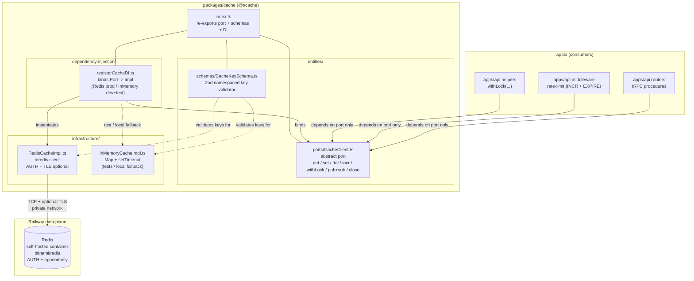

# @t/cache

The cache package — the shared in-memory / key-value module for the monorepo. Exposes a single
`CacheClient` port that every consumer (tRPC routers, rate-limit middleware, lock helpers, pub/sub
fanout) imports, with Redis (and an in-memory test double) slotted in via a DI registrar at the
composition root in `apps/api`. It sits next to `@t/db` and `@t/config` in the clean-architecture
template and is the canonical home for response caching, counter-based rate limiting (INCR +
EXPIRE), single-node distributed locks, and transient pub/sub fanout.

---

## High-Level Architecture



> **Current:** package complete as of 2026-04-26. `CacheClient` port, `RedisCacheImpl`,
> `InMemoryCacheImpl`, `CacheLockTimeoutError`, `buildCacheKey`/`CacheKeySchema`, and
> `registerCacheDI` all shipped. `RedisConfigSchema` and `resolveRedisConfig` in `@t/config`.
> `rateLimit` + `withCacheLock` helpers shipped in `src/helpers/` with 100% coverage. Composition
> root wired in `apps/api` (`registerCacheDI` called in correct order; 135 tests at 100% coverage).
> Integration tests live (`tests/integration/RedisCacheImpl.live.test.ts`,
> `vitest.integration.config.ts`, `docker-compose.cache.yml`). `railway.toml` `[redis]` service
> block declared. Manual Railway provisioning (service creation, sealed `REDIS_PASSWORD`, volume
> attachment) remains pending per-environment — see `docs/prd-status/packages/cache.md`.

---

## File Layout

Target layout (what the bootstrap lands at):

```text
packages/cache/src/
├── entities/
│   ├── ports/
│   │   └── CacheClient.ts           # abstract port
│   └── schemas/
│       └── CacheKeySchema.ts        # Zod: "<env>:<module>:<id>" format
├── infrastructure/
│   ├── RedisCacheImpl.ts            # ioredis against Railway Redis
│   └── InMemoryCacheImpl.ts         # Map-backed fallback for tests / local
├── dependency-injection/
│   └── registerCacheDI.ts           # binds CacheClient -> chosen Impl
└── index.ts                         # re-exports port + schemas + DI
```

---

## Ports & Impls

| Layer                  | Artifact                                         | Target state                                                              | Status      |
| --- | --- | --- | --- |
| Port                   | `entities/ports/CacheClient.ts`                  | Abstract: `get`, `set`, `del`, `incr`, `withLock`, `publish`, `subscribe`, `close` | Shipped |
| Schemas                | `entities/schemas/CacheKeySchema.ts`             | Zod validator enforcing `<env>:<module>:<id>` namespacing; `buildCacheKey` helper composes and validates segments | Shipped |
| Infra impl (Redis)     | `infrastructure/RedisCacheImpl.ts`               | `ioredis` against Railway Redis; AUTH + optional TLS; separate sub connection for pub/sub; constructor takes `RedisConfig` from `@t/config` | Shipped |
| Infra impl (InMemory)  | `infrastructure/InMemoryCacheImpl.ts`            | `Map` + `setTimeout`-based TTL; in-process pub/sub via per-channel handler sets; per-key promise-chain `withLock` | Shipped |
| Lock-timeout error     | `infrastructure/InMemoryCacheImpl.ts` → `CacheLockTimeoutError` | Exported error class thrown by both `withLock` implementations when acquisition exceeds `ttlSeconds` | Shipped |
| DI registrar           | `dependency-injection/registerCacheDI.ts`        | Options-bag registrar: `{ config, environment }` — selects `InMemoryCacheImpl` when `environment === 'testing'`, otherwise `RedisCacheImpl(config.redis)`; registered as singleton under `dependencyKeys.global.CACHE` (re-exported as `CACHE_DEPENDENCY_KEY`) | Shipped |
| Config schema          | `@t/config` → `entities/schemas/RedisConfigSchema.ts` | Zod: `url` (preferred), `host`, `port`, `password`, `tls`, `db` index; `resolveRedisConfig(env)` maps `REDIS_*` env vars through `.parse()` | Shipped |
| Rate-limit helper      | `src/helpers/rateLimit.ts`                       | `incr` + fixed-window counter; `RateLimitOptions` + `RateLimitResult` types; 100% coverage | Shipped |
| Lock helper            | `src/helpers/withCacheLock.ts`                   | Named wrapper over `cache.withLock`; stable documented surface; 100% coverage | Shipped |
| Pub/sub helper         | Consumers call `publish` / `subscribe` directly  | Transient fanout only; not a durable queue                                | Not started |

**Port contract** (shipped in `entities/ports/CacheClient.ts`):

```ts
export abstract class CacheClient {
  abstract get<T>(key: string): Promise<T | null>
  abstract set<T>(key: string, value: T, ttlSeconds?: number): Promise<void>
  abstract del(key: string): Promise<void>
  abstract incr(key: string, ttlSeconds?: number): Promise<number>
  abstract withLock<T>(key: string, ttlSeconds: number, fn: () => Promise<T>): Promise<T>
  abstract publish(channel: string, payload: unknown): Promise<void>
  abstract subscribe(channel: string, handler: (payload: unknown) => void): Promise<() => Promise<void>>
  abstract close(): Promise<void>
}
```

**Implementation notes:**

- `RedisCacheImpl.incr` runs an atomic Lua script (`INCR` + conditional `EXPIRE`) so the
  counter-bump and TTL (re)set happen in a single round trip.
- `RedisCacheImpl.withLock` uses `SET key token PX ttlMs NX` with a `crypto.randomUUID()` lock
  token, polls every 50ms up to `ttlSeconds`, and releases via a Lua CAS script that deletes only
  when the current value still matches the token. Acquisition failure throws `CacheLockTimeoutError`
  (re-exported from `@t/cache`). `InMemoryCacheImpl.withLock` mirrors the surface via a per-key
  promise chain and throws the same error on timeout.
- Pub/sub uses a dedicated subscriber connection (`client.duplicate()`) because `ioredis` forbids
  command traffic on a connection already in subscriber mode; the subscriber is created lazily on
  the first `subscribe()` call and closed by `close()`.

---

## Bootstrap Status

- [x] `entities/ports/CacheClient.ts` abstract port defined
- [x] `infrastructure/RedisCacheImpl.ts` built on `ioredis` against Railway Redis (AUTH + optional
  TLS + separate subscriber connection)
- [x] `infrastructure/InMemoryCacheImpl.ts` for tests and local dev when Redis is unavailable
- [x] `dependency-injection/registerCacheDI.ts` binds port to chosen impl, resolving `RedisConfig`
  from `@t/config` via the `{ config, environment }` options bag
- [x] `RedisConfigSchema` added to `@t/config` (`url`, `host`, `port`, `password`, `tls`, `db`) with
  `resolveRedisConfig(env)` helper
- [x] Rate-limit helper in `src/helpers/rateLimit.ts` uses `CacheClient.incr(key, ttl)`; 100%
  coverage (2026-04-26)
- [x] Distributed lock helper in `src/helpers/withCacheLock.ts` wraps `CacheClient.withLock`; 100%
  coverage (2026-04-26)
- [x] `railway.toml` declares a `redis` service (bitnami/redis:7.4, AOF, volume, `REDIS_URL` in
  `[api.env]`) (2026-04-26)
- [x] Integration tests: `tests/integration/RedisCacheImpl.live.test.ts` +
  `vitest.integration.config.ts` + `docker-compose.cache.yml`; unit tests use `InMemoryCacheImpl`
  (2026-04-26). GitHub Actions CI service container deferred.
- [x] `apps/api` composition root calls `registerCacheDI`; `CACHE_DEPENDENCY_KEY` resolves; 135
  tests at 100% coverage (2026-04-26)
- [x] Hoist `CACHE_DEPENDENCY_KEY` into `@t/dependency-injection` → `dependencyKeys.global.CACHE`
  (registrar imports the canonical token; `CACHE_DEPENDENCY_KEY` is preserved as a re-exported
  alias)

---

## Open Items

- **Single-node vs cluster.** Starting with a single self-hosted Redis container on Railway.
  Horizontal scale is not on the table for v1 — if memory pressure or throughput forces it, the port
  surface is small enough to swap in a cluster-aware client without touching consumers. Re-evaluate
  when sustained working set approaches node memory.
- **Persistence tradeoff.** `appendonly yes` gives durability across restarts (rate-limit counters,
  locks, response cache survive a redeploy) at the cost of disk I/O and a larger recovery window.
  Alternative is pure cache semantics (reset-on-restart) which simplifies ops but means every
  rate-limit window and cached response resets on each deploy. Leaning toward appendonly; revisit if
  disk pressure becomes real.
- **Pub/sub scope.** Redis pub/sub is fire-and-forget — if no subscriber is listening the message is
  dropped. That's fine for transient fanout (cache invalidation broadcasts, live presence pings),
  but anything requiring at-least-once delivery needs to graduate to a durable broker (Railway
  doesn't ship one natively — would mean self-hosted NATS/RabbitMQ or external SQS). The `publish` /
  `subscribe` methods stay on the port for now; we'll fork a dedicated `@t/queue` module if durable
  delivery becomes a requirement.
- **Key-namespacing strategy.** Enforce `<env>:<module>:<id>` via `CacheKeySchema` (e.g.,
  `production:ratelimit:user_123`, `development:session:abc...`). Prevents collisions across
  environments sharing a Redis instance and makes SCAN-based cleanup tractable. Schema lives in
  `entities/schemas/` so consumers construct keys through a typed builder rather than raw string
  concat.
- **Serialization.** JSON for v1 — it's universal, debuggable with `redis-cli`, and good enough for
  the payload sizes we care about. MessagePack is ~20–30% smaller and faster to parse but loses the
  ability to inspect values from the CLI. Not worth the complexity until payloads demonstrably
  matter.
- **Connection-pool behavior.** `ioredis` maintains a single persistent connection with
  auto-reconnect by default. Railway private networking is low-latency and stable, so a single
  connection per process is fine; pub/sub **requires** a second dedicated subscriber connection
  (Redis blocks the command channel while subscribed). Confirm reconnect/backoff tuning under
  Railway deploy restarts.
- **Test strategy.** Unit tests use `InMemoryCacheImpl` (deterministic, no container needed).
  Integration tests spin up an ephemeral Redis service container in GitHub Actions against
  `RedisCacheImpl` to catch real TTL rounding, pub/sub reconnect, and Lua-script edge cases. Local
  dev can fall back to `InMemoryCacheImpl` when no Redis is running, gated by an env flag so prod
  paths never silently degrade.
- **Lock helper caveats.** `withLock` is single-node Redlock-style (SETNX with PX, Lua-guarded
  release). It is **not** safe under split-brain — if Redis replicates to a replica and fails over
  mid-lock, two holders can coexist. For our single-node deployment this is a non-issue; the caveat
  must be documented on the helper so nobody reaches for it as a strong consistency primitive when
  the topology changes. Real distributed locking with quorum is explicitly out of scope.
