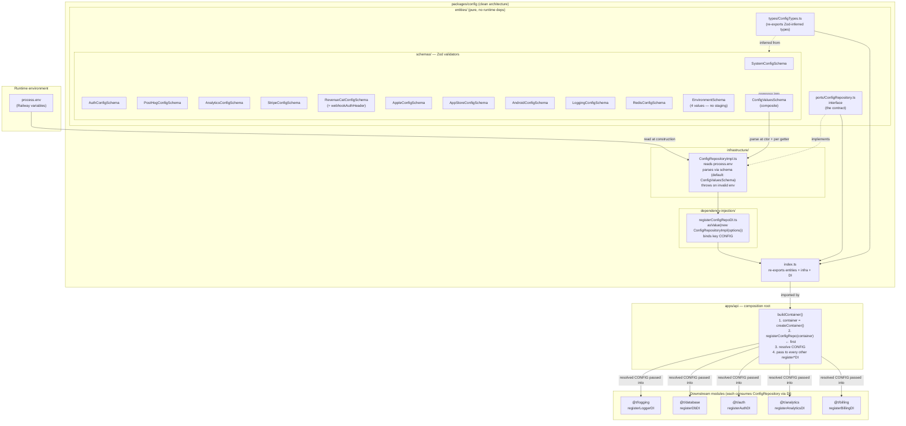

# @t/config

The typed env reader for the platform. `packages/config` owns the one safe way to read `process.env`
in this monorepo: every required variable is declared in a Zod schema, validated at construction,
and surfaced through a narrow `ConfigRepository` port. It is the canonical clean-architecture
template — every other module (`logging`, `database`, `auth`, `analytics`, `billing`) mirrors its
exact folder shape, and `apps/api`'s composition root registers it first so every other module can
depend on a validated config instance injected via DI.

## High-Level Architecture



## File Layout

```text
packages/config/
├── README.md                                     # package-level walkthrough
├── index.ts                                      # re-exports entities + infra + DI registrar
├── entities/
│   ├── index.ts
│   ├── ports/
│   │   ├── index.ts
│   │   └── ConfigRepository.ts                   # interface (the contract)
│   ├── schemas/
│   │   ├── index.ts
│   │   ├── ConfigValuesSchema.ts                 # composite of every subsystem (API default)
│   │   ├── WebConfigValuesSchema.ts              # web-scoped subset (system base + auth only)
│   │   ├── EnvironmentSchema.ts                  # "development"|"local"|"testing"|"production", default "development"
│   │   ├── SystemConfigSchema.ts                 # env, log level, port, ai url, tokens (isLocal = env==='local'||'development')
│   │   ├── AuthConfigSchema.ts                   # Clerk publishable key, secret key
│   │   ├── PostHogConfigSchema.ts                # analytics API key
│   │   ├── AnalyticsConfigSchema.ts              # PostHog full config (apiKey, personalApiKey, host, enabled)
│   │   ├── StripeConfigSchema.ts                 # api key, redirect domain, webhook secret
│   │   ├── RevenueCatConfigSchema.ts             # api key, project, entitlement, webhookAuthHeader
│   │   ├── AppleConfigSchema.ts                  # IAP verification URLs + shared secret
│   │   ├── AppStoreConfigSchema.ts               # bundle id, environment
│   │   ├── AndroidConfigSchema.ts                # publisher URL
│   │   ├── LoggingConfigSchema.ts                # log level, transport settings
│   │   └── RedisConfigSchema.ts                  # host, port, password, tls, db index
│   └── types/
│       ├── index.ts
│       └── ConfigTypes.ts                        # re-exports all Zod-inferred domain types
├── infrastructure/
│   ├── index.ts
│   └── ConfigRepositoryImpl.ts                   # process.env reader, validates at ctor
└── dependency-injection/
    └── registerConfigRepoDI.ts                   # asValue(new ConfigRepositoryImpl()) under dependencyKeys.global.CONFIG
```

## Ports & Impls

| Port (entities/ports) | Impl (infrastructure)   | Backing store           | DI registrar                                                                  |
| --- | --- | --- | --- |
| `ConfigRepository`    | `ConfigRepositoryImpl`  | `process.env` (Railway) | `registerConfigRepo(container, options?)` → `dependencyKeys.global.CONFIG` as value |

The port exposes one readonly accessor per subsystem (`system`, `posthog`, `analytics`, `auth`,
`stripe`, `revenueCat`, `apple`, `appStore`, `android`, `logging`, `redis`) and a `getAll():
ConfigValues` snapshot. The `gcp` accessor was removed 2026-04-26.

**Per-consumer schema scoping:** `registerConfigRepo` accepts an optional `{ schema }` option. When
provided, the impl validates startup against the consumer's Zod schema (via `_buildRawForSchema()`)
instead of the full `ConfigValuesSchema`. This allows apps/web to boot without setting API-only env
vars. Consumers pass only the schema for namespaces they use; individual getters for unchecked
namespaces still throw if called with missing vars.

```ts
// apps/api — full validation (default)
registerConfigRepo(container)

// apps/web — web-scoped validation
registerConfigRepo(container, { schema: WebConfigValuesSchema })

// apps/desktop — desktop-scoped validation (main process)
registerConfigRepo(container, { schema: DesktopConfigValuesSchema })
```

**Per-app schema map:**

| App | Schema | Source |
| --- | --- | --- |
| `apps/api` | `ConfigValuesSchema` (default) | `packages/config/entities/schemas/ConfigValuesSchema.ts` |
| `apps/web` | `WebConfigValuesSchema` | `packages/config/entities/schemas/WebConfigValuesSchema.ts` |
| `apps/desktop` | `DesktopConfigValuesSchema` | `packages/config/entities/schemas/DesktopConfigValuesSchema.ts` |

### isLocal derivation

`SystemConfig.isLocal` is derived as `environment === 'local' || environment === 'development'`. The old `K_SERVICE` Cloud Run sentinel was removed 2026-04-26.

### Env vars read today

Actual `process.env.*` keys touched by `ConfigRepositoryImpl` (verified against on-disk source).
This is the public surface of the config port.

| Subsystem    | Env vars consumed                                                                                                    |
| --- | --- |
| `system`     | `ENVIRONMENT`, `LOG_LEVEL`, `PORT`, `AI_SERVICE_URL`, `METRICS_AUTH_TOKEN`, `SYSTEM_API_KEY`                        |
| `auth`       | `CLERK_PUBLISHABLE_KEY`, `CLERK_SECRET_KEY`                                                                         |
| `posthog`    | `POSTHOG_API_KEY`                                                                                                    |
| `analytics`  | `POSTHOG_API_KEY`, `POSTHOG_PERSONAL_API_KEY`, `POSTHOG_HOST`, `POSTHOG_ENABLED`                                    |
| `logging`    | (logging transport / level settings — see `LoggingConfigSchema`)                                                    |
| `stripe`     | `STRIPE_KEY`, `STRIPE_REDIRECT_DOMAIN`, `STRIPE_WEBHOOK_SECRET`                                                     |
| `apple`      | `APPLE_PRODUCTION_URL`, `APPLE_SANDBOX_URL`, `APPLE_APP_SHARED_SECRET`                                              |
| `appStore`   | `APP_STORE_BUNDLE_ID`, `APP_STORE_ENVIRONMENT`                                                                      |
| `android`    | `ANDROID_PUBLISHER_URL`                                                                                              |
| `revenueCat` | `CORE_REVENUE_CAT_API_KEY`, `CORE_REVENUE_CAT_PROJECT_ID`, `CORE_REVENUE_CAT_NUTRAFORGE_ENTITLEMENT_ID`, `REVENUECAT_WEBHOOK_AUTH_HEADER` |
| `redis`      | `REDIS_HOST`, `REDIS_PORT`, `REDIS_PASSWORD`, `REDIS_TLS`, `REDIS_DB`                                               |

### Exported TypeScript types

`ConfigTypes.ts` re-exports Zod-inferred types for every subsystem. As of 2026-04-26:

`AnalyticsConfig`, `AuthConfig`, `DbConfig`, `LoggingConfig`, `RedisConfig`, `RevenueCatConfig`
(plus `SystemConfig`, `StripeConfig`, `AppleConfig`, `AppStoreConfig`, `AndroidConfig`,
`PostHogConfig`, `ConfigValues`). `GCPConfig` was removed 2026-04-26.

## Bootstrap Status

- [x] **Port defined** — `entities/ports/ConfigRepository.ts` exposes eleven readonly subsystem
  accessors plus `getAll(): ConfigValues`.
- [x] **Schemas defined** — 13 schemas under `entities/schemas/` (see file layout above).
  `GCPConfigSchema` deleted 2026-04-26.
- [x] **Impl done** — `ConfigRepositoryImpl` reads `process.env`, validates at ctor via a
  configurable Zod schema (defaults to full `ConfigValuesSchema`; pass `WebConfigValuesSchema` for
  web consumers), re-parses each subsystem slice inside its getter.
- [x] **DI registrar done** — `registerConfigRepo(container, options?)` binds a pre-constructed
  `ConfigRepositoryImpl` under `dependencyKeys.global.CONFIG` via `asValue(...)`. Accepts optional
  `{ schema }` for per-consumer scoping.
- [x] **`index.ts` exports** — re-exports `./entities`, `./infrastructure`, and the DI registrar.
- [x] **Wired into `apps/api` composition root** — `buildContainer()` calls
  `registerConfigRepo(container)` first; all other `register*DI` calls receive the resolved `CONFIG`
  token.
- [x] **Tests** — 116 tests across 8 Vitest spec files; 100%/100%/100%/100% coverage thresholds.
  `apps/api` 94/94 tests pass.
- [x] **`README.md`** — `packages/config/README.md` created 2026-04-26 as the canonical "how to
  build a platform module" walkthrough.

## Open Items

- **Package still exports tooling configs via `exports`.** `@t/config` also ships biome / tailwind /
  tsconfig configs — conflates "tooling config" with the "runtime config port". Out of scope for
  2026-04-26; tracked in prd-status/packages/config.md.
- **`registerAnalyticsDI` Environment-enum mismatch resolved (2026-04-26).** `EnvironmentSchema` now emits 4 values: `'development' | 'local' | 'testing' | 'production'`. `registerAnalyticsDI` accepts `Environment` directly from `@t/config` (the `as any` cast in `composition.ts` was removed). `staging` dropped from all enum sites.
