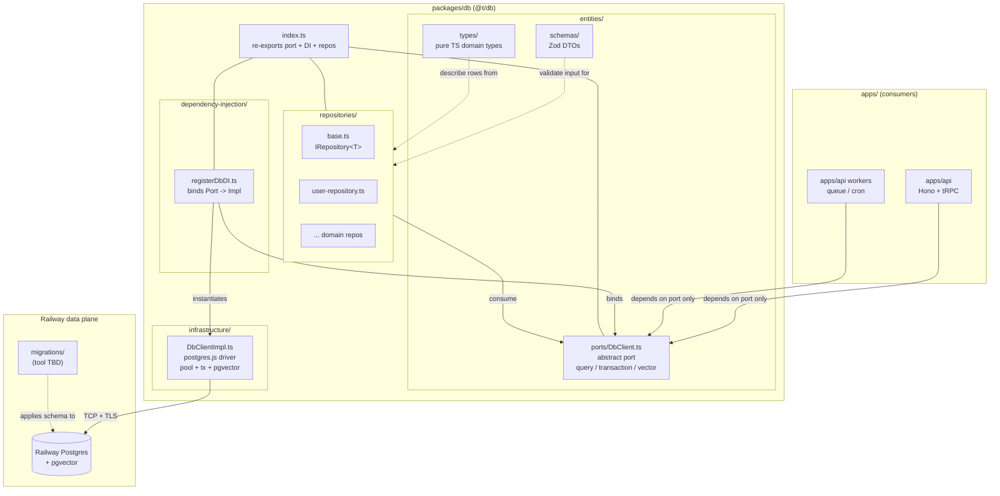

# @t/db

The database package — the data-access module for the monorepo. Exposes a single `DbClient` port
that every consumer (routers, repositories, workers) imports, with infrastructure impls slotted in
via a DI registrar at the composition root in `apps/api`.

**Current state:** the package is Supabase-based (`@supabase/supabase-js` with a generated
`Database` type) from the pre-Railway pivot. Repositories live under `packages/db/src/repositories/`
but operate against `SupabaseClient`, not a platform-owned port.

**Target state:** Railway Postgres + `pgvector`, accessed through a `DbClient` abstract port
(`postgres.js` under the hood), with repositories depending on the port only. Matches the
clean-architecture shape already shipped in `packages/config` and documented in
`docs/architecture/ARCHITECTURE.md`.

---

## High-Level Architecture



> **Current:** Supabase client (`@supabase/supabase-js`) is in place; `DbClient` port,
> `DbClientImpl`, and `registerDbDI` are **not yet** present. Migration to Railway Postgres +
> pgvector pending.

---

## File Layout

Actual `packages/db/src/` on disk today (pre-migration):

```text
packages/db/
├── package.json                  # exports: ".", "./types", "./schemas"
├── tsconfig.json
└── src/
    ├── index.ts                  # re-exports supabase client + repos + schemas
    ├── client.ts                 # createClient(url, anonKey) + createServiceClient()
    ├── schemas.ts                # Zod: UserRole, ProjectStatus, Create/Update, Pagination
    ├── types.ts                  # generated `Database` type (supabase gen types)
    ├── seed.ts                   # dev seed using service client
    └── repositories/
        ├── base.ts               # IRepository<T, Insert, Update> interface
        ├── supabase-repository.ts# abstract SupabaseRepository<TableName>
        └── user-repository.ts    # extends SupabaseRepository<'users'>
```

Target layout (what the migration lands at):

```text
packages/db/src/
├── entities/
│   ├── ports/
│   │   └── DbClient.ts
│   ├── schemas/                  # promoted from src/schemas.ts
│   └── types/                    # promoted from src/types.ts (Railway-native)
├── infrastructure/
│   └── DbClientImpl.ts           # postgres.js against Railway
├── repositories/                 # keep existing; switch base to use port
│   ├── base.ts
│   └── user-repository.ts
├── dependency-injection/
│   └── registerDbDI.ts
└── index.ts
```

---

## Ports & Impls

| Layer                  | Artifact                                | Target state                                                  | Status                  |
| --- | --- | --- | --- |
| Port                   | `entities/ports/DbClient.ts`            | Abstract: `query`, `transaction`, `vectorSearch`, `close`     | Not started             |
| Schemas                | `entities/schemas/*`                    | Zod DTOs for repo inputs (promoted from `src/schemas.ts`)     | Partial (flat file)     |
| Types                  | `entities/types/*`                      | Pure TS row types (replaces supabase-generated `Database`)    | Supabase-generated      |
| Infra impl             | `infrastructure/DbClientImpl.ts`        | `postgres.js` pool on Railway; pgvector helpers co-located    | Not started             |
| Legacy impl (current)  | `src/client.ts`                         | `@supabase/supabase-js` anon + service clients                | Present (to remove)     |
| Repositories           | `repositories/*.ts`                     | Depend on `DbClient` port, not `SupabaseClient`               | Present but Supabase-bound |
| DI registrar           | `dependency-injection/registerDbDI.ts`  | Binds `DbClient` → `DbClientImpl` in the apps/api container   | Not started             |
| Vector queries         | Inside `DbClientImpl` (pgvector helpers)| Typed `vectorSearch(table, column, embedding, k)`             | Not started             |
| Migrations             | `packages/db/migrations/` (tool TBD)    | Drizzle Kit / node-pg-migrate / Atlas — decision pending      | Not started             |

**Port contract sketch** (target):

```ts
export abstract class DbClient {
  abstract query<T>(sql: string, params?: unknown[]): Promise<T[]>
  abstract transaction<T>(fn: (tx: DbClient) => Promise<T>): Promise<T>
  abstract vectorSearch<T>(opts: VectorSearchOpts): Promise<T[]>
  abstract close(): Promise<void>
}
```

---

## Bootstrap Status

- [ ] `entities/ports/DbClient.ts` abstract port defined
- [ ] `infrastructure/DbClientImpl.ts` on Railway Postgres (currently Supabase anon + service
  clients in `src/client.ts`)
- [ ] `dependency-injection/registerDbDI.ts` binds port to impl
- [ ] `pgvector` extension enabled on the Railway Postgres service
- [ ] Migration tool chosen and first migration applied (Drizzle Kit vs node-pg-migrate vs Atlas —
  undecided)
- [ ] `apps/api` composition root calls `registerDbDI` and every router depends on the port only
- [ ] Integration tests run against an ephemeral Railway Postgres instance (or a local postgres
  container in CI)
- [ ] `railway.toml` declares a `postgres` service
- [ ] Supabase deps (`@supabase/supabase-js`, `supabase` CLI) removed from
  `packages/db/package.json`
- [ ] `gen:types` script replaced with the chosen migration tool's introspection (or removed if
  schemas are hand-written)
- [ ] `seed.ts` rewritten against the port (no `supabase.auth.admin`)

---

## Migration Path

Supabase → Railway Postgres, staged so `apps/api` keeps compiling throughout:

- **1. Provision.** Add `postgres` service to `railway.toml`; enable `pgvector` extension; capture
  `DATABASE_URL` into Railway project vars per env.
- **2. Pick a migration tool.** Evaluate Drizzle Kit (types + migrations), node-pg-migrate
  (SQL-first), or Atlas (declarative). Record choice in ADR.
- **3. Port definition.** Add `entities/ports/DbClient.ts` with `query` / `transaction` /
  `vectorSearch` / `close`. No consumers yet.
- **4. Impl.** Add `infrastructure/DbClientImpl.ts` using `postgres.js` against `DATABASE_URL`.
  Unit-test `query` and `transaction` rollback.
- **5. Schema port.** Author migrations for `users`, `projects` (replacing the Supabase-generated
  `Database` type). Regenerate or hand-write row types into `entities/types/`.
- **6. DI registrar.** Add `dependency-injection/registerDbDI.ts`; wire into `apps/api` composition
  root alongside the existing Supabase client (dual-write window).
- **7. Flip repositories.** Switch `SupabaseRepository<T>` to a port-backed `PgRepository<T>` (same
  `IRepository<T>` interface) and update `UserRepository` to extend it.
- **8. Drop Supabase.** Remove `@supabase/supabase-js`, `supabase` CLI devdep, `client.ts`,
  `src/types.ts`. Update `index.ts` re-exports. Rewrite `seed.ts`.
- **9. CI.** Spin up a postgres container in GitHub Actions and run integration tests against it.
- **10. Docs.** Update this file's checkboxes and flip the "Current" note under the diagram.

---

## Open Items

- **Migration tool.** Drizzle Kit gives us inferred row types for free but couples us to its query
  builder; node-pg-migrate is closer to raw SQL and keeps the port surface narrow. Decision blocks
  steps 2 and 5.
- **Row-level security.** Supabase leaned on PG RLS plus JWT claims. On Railway Postgres we own the
  auth boundary end-to-end via `@t/auth`; decide whether to keep RLS policies or enforce tenancy at
  the repository layer.
- **`pgvector` ergonomics.** Expose `vectorSearch` on the port, or keep it as a free function in the
  impl and pass the port in? Leaning toward a method on the port so routers never import the impl.
- **Connection pooling.** `postgres.js` has its own pool; Railway Postgres sits behind
  pgbouncer-style proxying — confirm transaction mode compatibility before enabling prepared
  statements.
- **`seed.ts` replacement.** Currently uses `supabase.auth.admin.createUser`. Once `@t/auth` lands
  (Clerk-backed), seed should create users through Clerk's Backend API (or invite-link flow), not
  directly in a `users` table.
- **Clerk user-sync webhook.** `apps/api` receives `user.created` / `user.updated` / `user.deleted`
  events from Clerk via `POST /webhooks/clerk` and mirrors them into `users`. The `users` table must
  carry a `clerk_user_id` unique column as the link between the Clerk identity and the app row. No
  auth state (password hashes, sessions, MFA factors) lives in Postgres — Clerk owns all of it. The
  migration that adds the `users` table should include `clerk_user_id TEXT NOT NULL UNIQUE` and an
  index on it for efficient lookup during webhook processing.
- **Test strategy.** Spin up a throwaway postgres in CI (GitHub service container) vs ephemeral
  Railway Postgres for integration tests. Local-first is cheaper and deterministic; Railway-parity
  catches proxy behavior.
- **Bun compatibility.** `postgres.js` works under Bun; `better-sqlite3` does not. Keep the port
  abstract enough that a SQLite-backed test impl is possible if we need one later (would need
  `bun:sqlite` instead).
