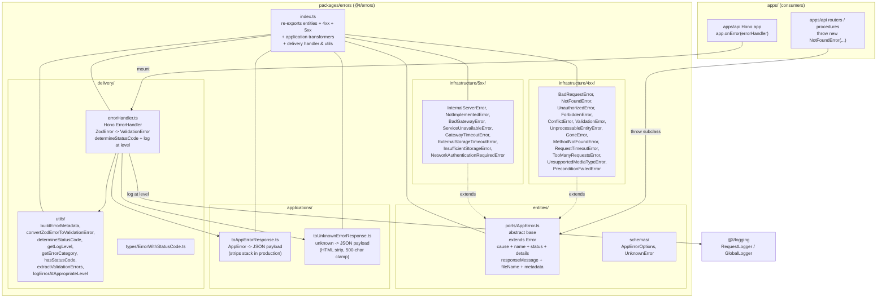

# @t/errors

Typed error catalog and HTTP error-handler middleware for the monorepo. Exposes a single abstract
`AppError` port that every app-owned error type extends, a curated catalog of HTTP 4xx and 5xx
classes (`BadRequestError`, `NotFoundError`, `ValidationError`, `InternalServerError`, etc.),
application-layer response transformers, and a Hono `ErrorHandler` for the delivery layer. Sits
alongside `@t/logging` in the clean-architecture template — every other platform package (`@t/auth`,
`@t/billing`, `@t/cache`, `@t/db`) throws subclasses of `AppError`, and the delivery layer in
`apps/api` mounts the shared `errorHandler` via `app.onError(errorHandler)`.

---

## High-Level Architecture



---

## `AppError` contract

`AppError` is an abstract class extending the platform `Error` (so `instanceof Error` works, stack
traces propagate, and `cause` chains follow the WHATWG/ESM convention). Every concrete subclass
overrides three abstract getters:

- `get name(): string` — human-readable error name (e.g. `"Not Found"`)
- `get status(): ContentfulStatusCode` — HTTP status code (Hono's `ContentfulStatusCode`)
- `get details(): string` — short developer-focused description

The constructor takes a developer message, a user-safe `responseMessage`, and an options bag with
`cause`, `fileName`, and `metadata`:

```ts
constructor(
  message: string,
  responseMessage: string,
  opt?: { cause?: unknown; fileName?: string; metadata?: Record<string, unknown> },
)
```

`super(message, { cause: opt?.cause })` is invoked so `this.cause` and `this.stack` are populated by
the platform.

### Subclass pattern

Every catalog class follows the same shape — see `infrastructure/4xx/NotFoundError.ts` for the
canonical example:

```ts
import { AppError } from "../../entities/ports/AppError.ts";

export class NotFoundError extends AppError {
  get name(): string { return "Not Found"; }
  get status(): ContentfulStatusCode { return 404; }
  get details(): string { return "Resource doesn't exist."; }

  constructor(
    message: string,
    responseMessage: string,
    opt?: { cause?: unknown; fileName?: string; metadata?: Record<string, unknown> },
  ) {
    super(message, responseMessage, opt);
  }
}
```

Imports are **relative** (no path alias). Earlier scaffolding used `@/entities/errors` / `@/errors`
aliases that did not resolve and broke both typecheck and graph extraction; relative imports are the
canonical convention now.

---

## Catalog

| Class                            | Status | Layer  | Notes |
| --- | :---: | --- | --- |
| `BadRequestError`                | 400    | 4xx    | Malformed syntax / shape |
| `ValidationError`                | 400    | 4xx    | Zod / schema failures (use `convertZodErrorToValidationError`) |
| `UnauthorizedError`              | 401    | 4xx    | Authentication required / failed |
| `ForbiddenError`                 | 403    | 4xx    | Authenticated but not allowed |
| `NotFoundError`                  | 404    | 4xx    | Resource doesn't exist |
| `MethodNotFoundError`            | 405    | 4xx    | HTTP method not supported |
| `RequestTimeoutError`            | 408    | 4xx    | Client took too long |
| `ConflictError`                  | 409    | 4xx    | Duplicate / state conflict |
| `GoneError`                      | 410    | 4xx    | Permanently removed |
| `PreconditionFailedError`        | 412    | 4xx    | Conditional header mismatch |
| `UnsupportedMediaTypeError`      | 415    | 4xx    | Wrong Content-Type |
| `UnprocessableEntityError`       | 422    | 4xx    | Semantic / business-rule failure |
| `TooManyRequestsError`           | 429    | 4xx    | Rate limit exceeded |
| `InternalServerError`            | 500    | 5xx    | Generic server failure |
| `NotImplementedError`            | 501    | 5xx    | Endpoint exists but unimplemented |
| `BadGatewayError`                | 502    | 5xx    | Invalid upstream response |
| `ServiceUnavailableError`        | 503    | 5xx    | Temporary overload / maintenance |
| `GatewayTimeoutError`            | 504    | 5xx    | Upstream did not respond in time |
| `ExternalStorageTimeoutError`    | 504    | 5xx    | GCS/S3-style storage timeout |
| `InsufficientStorageError`       | 507    | 5xx    | WebDAV — disk / quota full |
| `NetworkAuthenticationRequiredError` | 511 | 5xx | Captive portal / network auth |

---

## Delivery layer

`errorHandler` is a Hono `ErrorHandler`. Mount once at the composition root:

```ts
import { Hono } from "hono";
import { errorHandler } from "@t/errors";

const app = new Hono();
app.onError(errorHandler);
```

Behaviour:

1. If the caught error is a `ZodError`, it is converted to a `ValidationError` via
   `convertZodErrorToValidationError` (the original Zod issues are placed on
   `cause.validationErrors`).
2. `determineStatusCode` resolves status: `AppError.status` > external `error.statusCode` > 500.
3. `buildErrorMetadata` enriches a metadata payload with `errorCategory`, `route`, `method`,
   `userId`, `requestId`, and (for `ValidationError`) the flattened validation issues.
4. `logErrorAtAppropriateLevel` logs via the request-scoped `Logger` from `c.get('logger')` (when
   present) or a fallback `createGlobalLogger()` using the level mapping in `getLogLevel` (401/404 →
   `warning`, other 4xx → `info`, 5xx → `error`).
5. **Analytics capture (2026-04-26).** When `c.get('analytics')` resolves to a
   `RequestAnalyticsTracker`, the handler calls `analytics.captureException(error, { route, method,
   requestId })` — the new context-bag overload
   (`packages/analytics/src/infrastructure/RequestAnalyticsTrackerImpl.ts:54-69`) auto-fills
   `distinctId` from the scoped user (falling back to `sessionId`/`requestId`). When absent, capture
   is silently skipped.
6. The response body is built with `toAppErrorResponse` (for `AppError`) or `toUnknownErrorResponse`
   (for everything else — strips HTML and clamps to 500 chars). Stacks are stripped when
   `process.env.ENVIRONMENT` is `production`.

Consumer context-key contract (Hono `ContextVariableMap`, augmented by `delivery/hono.d.ts`):

| Key          | Type                                          | Producer (apps/api)                                                  | Fallback when absent                              |
| --- | --- | --- | --- |
| `requestId`  | `string \| undefined`                         | `request-context.ts` — `crypto.randomUUID()`                          | metadata simply omits the field                  |
| `logger`     | `Logger \| undefined`                         | `request-context.ts` — `createGlobalLogger({ requestId, metadata })` | `createGlobalLogger()` global logger             |
| `analytics`  | `AnalyticsTracker \| RequestAnalyticsTracker \| undefined` | `request-context.ts` — `container.createScope()` request-scoped tracker | capture call is skipped                          |

All three are OPTIONAL and the handler degrades gracefully when any is absent. Reference consumer
wiring: `apps/api/src/middleware/request-context.ts`, `apps/api/src/index.ts`,
`apps/api/src/lifecycle.ts`.

---

## Public surface

Top-level barrel (`packages/errors/index.ts`) re-exports:

- **Entities:** `AppError`, `AppErrorOptions`, `UnknownError`
- **Infrastructure:** every 4xx and 5xx class above
- **Applications:** `toAppErrorResponse`, `toUnknownErrorResponse`
- **Delivery:** `errorHandler` plus all utilities (`buildErrorMetadata`,
  `convertZodErrorToValidationError`, `determineStatusCode`, `extractValidationErrors`,
  `getErrorCategory`, `getLogLevel`, `hasStatusCode`, `logErrorAtAppropriateLevel`,
  `ErrorWithStatusCode`)

Consumers should import from the package root only:

```ts
import {
  AppError,
  NotFoundError,
  ValidationError,
  errorHandler,
  toAppErrorResponse,
} from "@t/errors";
```

---

## Module layout

```text
@t/errors
  entities/
    ports/AppError.ts          abstract base (extends Error, cause-aware)
    schemas/AppErrorOptions    options shape
    schemas/UnknownError       UnknownError response shape
  infrastructure/
    4xx/                       13 client-error classes
    5xx/                       8 server-error classes
  applications/
    toAppErrorResponse.ts      AppError -> JSON
    toUnknownErrorResponse.ts  unknown -> sanitized JSON
  delivery/
    errorHandler.ts            Hono ErrorHandler
    utils/                     status / category / logging helpers
    types/ErrorWithStatusCode  external-lib error shape
  index.ts                     public barrel
  package.json                 @t/errors (workspace:*)
  tsconfig.json
```

No DI registrar — the package is stateless. The only runtime hook is `errorHandler`, mounted
directly via `app.onError`.

---

## Dependencies

- **`@t/logging`** — `createGlobalLogger`, `RequestLogger` (used inside `logErrorAtAppropriateLevel`
  and `errorHandler`)
- **`hono`** — `Context`, `ErrorHandler`, `ContentfulStatusCode`
- **`zod`** — `ZodError` (converted to `ValidationError` in the handler)

No DB, cache, or HTTP dependencies — error formatting is pure.

---

## Changelog

### 2026-04-26

- `staging` removed from env enum; stack-stripping now strictly `=== 'production'`.
- `errorHandler` rewritten to read `requestId` / `logger` / `analytics` from Hono context
  (`c.get(...)`) with graceful fallback when any is absent. Analytics capture now flows via the new
  `RequestAnalyticsTracker.captureException(error, context?)` overload (auto-fills `distinctId` from
  scoped user). `delivery/hono.d.ts` added to augment the Hono `ContextVariableMap`. Producer-side
  wiring shipped in `apps/api/src/middleware/request-context.ts` (NEW) and
  `apps/api/src/lifecycle.ts` (NEW). 139/139 tests at 100% coverage.
