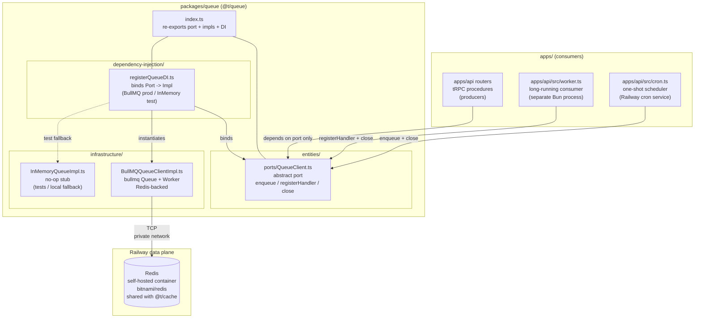

# @t/queue

The queue package — the shared background-job module for the monorepo. Exposes a single
`QueueClient` port that every consumer (`apps/api` worker entrypoint, cron entrypoint,
fire-and-forget enqueues from tRPC procedures) imports, with BullMQ (and an in-memory test stub)
slotted in via a DI registrar at the composition root in `apps/api`. It sits next to `@t/cache` and
`@t/db` in the clean-architecture template and is the canonical home for durable, retried,
out-of-band work — the durability complement to `@t/cache`'s transient pub/sub.

---

## High-Level Architecture



> **Current:** package complete as of 2026-04-28. `QueueClient` port, `BullMQQueueClientImpl`,
> `InMemoryQueueImpl`, and `registerQueueDI` all shipped (commit `3aa4b61`). Composition root wired
> in `apps/api`; consumer entrypoints `apps/api/src/worker.ts` (worker daemon) and
> `apps/api/src/cron.ts` (one-shot scheduler) landed in the same commit. BullMQ-specific knobs
> (concurrency, default `attempts` / `backoff`, repeat-job scheduling) are not yet surfaced through
> `@t/config` — see Open Items.

---

## File Layout

```text
packages/queue/src/
├── entities/
│   └── ports/
│       └── QueueClient.ts             # abstract port
├── infrastructure/
│   ├── BullMQQueueClientImpl.ts       # bullmq Queue + Worker against Redis
│   └── InMemoryQueueImpl.ts           # no-op stub for tests / local
├── dependency-injection/
│   └── registerQueueDI.ts             # binds QueueClient -> chosen Impl
└── index.ts                           # re-exports port + impls + DI
```

---

## Ports & Impls

| Layer                  | Artifact                                         | Target state                                                              | Status      |
| --- | --- | --- | --- |
| Port                   | `entities/ports/QueueClient.ts`                  | Abstract: `enqueue`, `registerHandler`, `close`                           | Shipped |
| Infra impl (BullMQ)    | `infrastructure/BullMQQueueClientImpl.ts`        | `bullmq` `Queue` + `Worker` against Railway Redis; constructor takes `RedisConfig` from `@t/config` + `Logger` from `@t/logging`; single worker dispatches to handlers keyed by `jobName`; `close()` shuts queue + every worker | Shipped |
| Infra impl (InMemory)  | `infrastructure/InMemoryQueueImpl.ts`            | No-op stub; `enqueue` and `registerHandler` discard input; `close()` flips a closed flag and `enqueue()` after close throws | Shipped |
| DI registrar           | `dependency-injection/registerQueueDI.ts`        | Options-bag registrar: `{ config, environment }` — selects `InMemoryQueueImpl` when `environment === 'testing'`, otherwise `BullMQQueueClientImpl(config.redis, logger)`; registered as singleton under `dependencyKeys.global.QUEUE` (re-exported as `QUEUE_DEPENDENCY_KEY`) | Shipped |
| Config schema          | `@t/config` → `entities/schemas/RedisConfigSchema.ts` | Re-used from `@t/cache`; same `RedisConfig` (url / host / port / password / tls / db) feeds both modules | Shipped |
| BullMQ scheduler knobs | (none yet)                                       | Concurrency, default `attempts` / `backoff`, repeat-job scheduling not yet wired into `@t/config` | Not started |

**Port contract** (shipped in `entities/ports/QueueClient.ts`):

```ts
export abstract class QueueClient {
  abstract enqueue<T>(
    jobName: string,
    payload: T,
    opts?: { delayMs?: number; retries?: number; priority?: number },
  ): Promise<void>

  abstract registerHandler<T = unknown>(
    jobName: string,
    handler: (payload: T) => Promise<void>,
  ): void

  abstract close(): Promise<void>
}
```

**Implementation notes:**

- `BullMQQueueClientImpl` constructs a single `bullmq` `Queue` and a single `Worker` keyed by
  `queueName` (default `'default'`). The worker's processor function looks up the registered handler
  in a `Map<jobName, handler>`; missing handlers log a warning and the job no-ops. Handler
  exceptions log via the injected `Logger` and re-throw so BullMQ can apply its retry policy.
- `enqueue()` currently passes through `jobName` and `payload` only — the optional `opts`
  (`delayMs`, `retries`, `priority`) on the port surface are not yet forwarded into BullMQ's job
  options. Wiring those through is part of the open BullMQ-knobs work item below.
- `close()` `Promise.all`s a `queue.close()` and every `worker.close()` so a single SIGTERM tears
  the entire backend down deterministically. `apps/api/src/lifecycle.ts` calls this from its
  SIGTERM/SIGINT handler.
- `InMemoryQueueImpl` is a deliberate **stub**, not a working in-process queue. `enqueue()` is a
  no-op (jobs are discarded), `registerHandler()` is a no-op (handlers are never invoked), `close()`
  only flips a closed flag. This is sufficient to satisfy DI resolution under `environment ===
  'testing'` without spinning up Redis. Anything that needs to assert "the job actually ran" must
  mock `QueueClient` directly in the test, not rely on the in-memory stub.

---

## DI wiring

```ts
import { registerQueueDI, QUEUE_DEPENDENCY_KEY, type QueueClient } from '@t/queue'

registerQueueDI(container, {
  config,                                // ConfigRepository from @t/config
  environment: 'production',             // 'development' | 'testing' | 'production' | ...
})

const queue = container.resolve<QueueClient>(QUEUE_DEPENDENCY_KEY)
```

- `QUEUE_DEPENDENCY_KEY` is a re-exported alias of the canonical `dependencyKeys.global.QUEUE` token
  owned by `@t/dependency-injection`.
- Selection: `environment === 'testing'` → `InMemoryQueueImpl`; otherwise →
  `BullMQQueueClientImpl(config.redis, logger)`.
- Lifetime is `singleton` — the queue owns long-lived Redis connections; a scoped/transient lifetime
  would thrash connect/close per request.
- The factory throws `Error('registerQueueDI: config.redis is required when environment is
  "<env>"')` if `config.redis` is absent in a non-testing environment. That mirrors
  `registerCacheDI`'s contract.
- The BullMQ branch resolves a global `Logger` via `createGlobalLogger({})` rather than reading from
  the container — registering a logger dependency from inside another registrar would force ordering
  constraints we don't want to bake in. Composition-root tests still mock both `bullmq` and
  `@t/logging` so DI resolution opens no sockets.

---

## Config

Wired into `@t/config` → `config.redis` via the existing `RedisConfigSchema` (no queue-specific
schema yet — BullMQ rides on the same Redis instance as `@t/cache`):

```text
REDIS_URL        full connection URL (preferred if set)
REDIS_HOST       host (default: 127.0.0.1)
REDIS_PORT       port (default: 6379)
REDIS_PASSWORD   optional
REDIS_TLS        truthy -> enable TLS
REDIS_DB         optional db index
```

BullMQ-specific knobs (concurrency, default `attempts` / `backoff`, repeat-job scheduling,
dead-letter naming) are **not** yet exposed through `@t/config`. Today they live as constructor
defaults in `BullMQQueueClientImpl` (`queueName = 'default'`, single worker, no per-job options
forwarded). See Open Items below.

---

## Testing

- Unit tests use `InMemoryQueueImpl` (deterministic, no Redis required).
- `BullMQQueueClientImpl` unit tests mock `bullmq` directly — no real Redis traffic. They assert
  that:
  - The constructor creates `Queue` + `Worker` with the resolved connection.
  - `enqueue(name, payload)` calls `queue.add(name, payload)`.
  - `registerHandler(name, handler)` stores the handler in the internal map; the worker processor
    dispatches by `job.name` and warns on missing handlers.
  - Handler exceptions log + re-throw so BullMQ retries fire.
  - `close()` closes both the queue and every worker.
- DI registrar tests mock both `bullmq` and `@t/logging` so construction does not open sockets or
  initialise transports.
- Coverage thresholds in `packages/queue/vitest.config.ts` are 100% statement / branch / function /
  line. No integration suite yet — when one lands it will follow the `@t/cache` pattern
  (`vitest.integration.config.ts` + `tests/integration/*.live.test.ts` + a
  `docker-compose.queue.yml` against a real Redis).

---

## Open Items

- **BullMQ knobs into `@t/config`.** Concurrency (per-worker), default `attempts` / `backoff`,
  dead-letter queue naming, and repeat-job scheduling are not yet surfaced through `@t/config` —
  they're hard-coded constructor defaults in `BullMQQueueClientImpl` (single worker, default queue
  name, no per-job opts forwarded). Wire a `QueueConfigSchema` (or extend `RedisConfigSchema` with a
  `queue` sub-shape) once a consuming app needs to tune them.
- **`enqueue` opts pass-through.** The port surface accepts `{ delayMs?, retries?, priority? }`, but
  `BullMQQueueClientImpl.enqueue` ignores them today — they need to be mapped onto BullMQ's
  `JobsOptions` (`delay`, `attempts`, `priority`). Tracked alongside the schema work above.
- **Repeat-job scheduling.** `apps/api/src/cron.ts` currently enqueues a one-shot `'heartbeat'` as a
  placeholder because the port has no `repeat` option. Extending the port (or adding a sibling
  `enqueueRepeating(name, payload, cronExpr)` method) is the path to real cron-driven recurring
  work.
- **DLQ + observability.** No dead-letter queue, no per-job tracing, no Prometheus metrics yet.
  BullMQ exposes events (`completed`, `failed`, `stalled`) — wiring those into `@t/analytics` and
  the OTLP transport in `@t/logging` is open.
- **Integration tests.** Unit tests mock `bullmq`. Real-Redis integration coverage (queue/worker
  round-trip, retry semantics, graceful shutdown under load) is deferred until W7's CI hardening.
- **Single-worker assumption.** `BullMQQueueClientImpl` constructs one `Worker` in its constructor.
  Multi-worker / sharded-queue topologies are out of scope for v1; the surface stays small enough
  that a fan-out wrapper can be added without breaking consumers.
- **`InMemoryQueueImpl` is a stub, not a queue.** It does not actually run handlers. Consumers
  wanting an in-process executor (for end-to-end tests) must either mock `QueueClient` or build a
  real in-memory implementation behind the same port. Document the limitation on every helper that
  resolves it.
