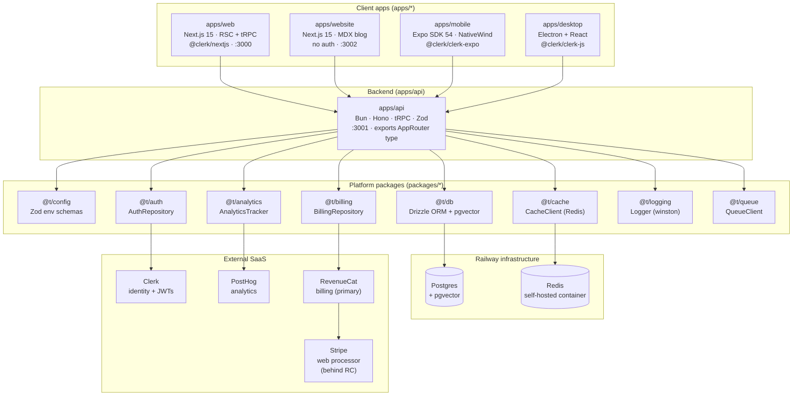

# Explanation: architecture overview

By the end of this doc you will have a durable mental model of how the five client apps, the API
server, the platform packages, and the external SaaS layer fit together — and why they are
structured this way.

---

## What this file is for

This is the top-level conceptual map of the template monorepo. It explains the structural decisions
behind the repo — not how to run it or how to add a route, but why things are shaped the way they
are. Read it before diving into any subsystem doc.

## When to update it

- A new app is added or an existing app changes its role
- A platform package is added, removed, or has its port contract redesigned
- The deployment topology changes (new Railway service, new external SaaS vendor)
- A significant architectural decision (ADR) alters a pattern described here

---

## Background

This repo is a monorepo template for bootstrapping full-product SaaS applications. The goal is one
clone, every surface: a backend API, a web product, a marketing website, a mobile app, and a
desktop app — all wired up, type-safe, and ready for a team to build on.

The stack choices (Bun, Turborepo, tRPC, Drizzle, Clerk, RevenueCat, PostHog, Railway) were made
once and locked in so that teams starting from this template do not spend weeks debating
infrastructure. The architecture choices (Clean Architecture, ports + impls + registrars) were made
to keep each surface independently testable and replaceable without touching every consumer.

---

## The system at a glance



---

## Mental model: ports + impls + registrars

Every platform package follows the same three-file shape:

```text
packages/<module>/src/
  entities/ports/<X>.ts           the interface — what callers depend on
  infrastructure/<XImpl>.ts       the concrete class — the real I/O
  dependency-injection/register<X>DI.ts   the wiring — binds impl to token
```

The port lives in `entities/` because it is a domain concept: it describes a capability the system
needs, with no opinion on how that capability is satisfied. The implementation lives in
`infrastructure/` because it is an I/O detail: it knows about Redis keys, Drizzle query syntax,
Clerk SDK methods, or PostHog event names. The registrar bridges the two by reading a token from
`@t/dependency-injection`'s `dependencyKeys` registry and binding the concrete class to it in the
Awilix container.

This layering means callers never import `CacheClientImpl` directly. They import `CacheClient` (the
port) and receive the concrete class through the container at runtime. Swapping an implementation
— say, from Redis to an in-memory store in tests — requires changing one registrar call, not every
file that touches the cache.

The composition root that wires everything together is
`apps/api/src/composition.ts#buildContainer()`.
It calls each `register*DI(container, opts)` function in dependency order: config first (because
everything else reads env vars through it), then logging, then db, cache, auth, analytics, billing.
The container returned by `buildContainer()` is what the tRPC context factory resolves services
from.

---

## Five client apps, one tRPC AppRouter

`apps/api` exports a single `AppRouter` type — not a generated client, not a REST spec, just a
TypeScript type that encodes every procedure, its input shape, and its output shape. All five client
apps (`web`, `website`, `mobile`, `desktop`, and `api`'s own internal consumers) import that type
directly. tRPC's client uses it to give callers end-to-end type safety: if a procedure input changes
on the server, TypeScript surfaces the error in every caller at compile time. There is no code
generation step, no OpenAPI roundtrip, and no REST gateway — the type IS the contract.

---

## Data flow

A request enters `apps/api` over HTTPS, routed through Hono. Two middleware layers run first:
`requestContext` stamps a trace ID onto the request scope, and the Clerk auth middleware validates
the Bearer JWT and populates `ctx.auth`. The request then reaches a tRPC procedure — `users.me`,
for example — which resolves a `UserRepository` (or `AuthRepository`) from the container via
`ctx.container.resolve(dependencyKeys.global.authRepository)`. The repository's implementation
talks to Drizzle (Postgres) or ioredis (Redis) using Railway's private-domain connection strings.
The procedure serializes the result and returns it to the caller. Nothing outside `apps/api` touches
the database or cache directly.

---

## Deployment topology

Three app services are deployed on Railway: `api` (port 3001, Dockerfile build, health check at
`/health`), `web` (port 3001, `bun run start`), and `website` (port 3002, `bun run start`, health
check at `/api/health`). Two service containers run alongside them: a self-hosted
`pgvector/pgvector:pg16` Postgres instance with a volume-backed `/var/lib/postgresql/data` mount,
and a self-hosted `bitnami/redis:7.4` container with AOF + RDB persistence at
`/bitnami/redis/data`. The API service receives `DATABASE_URL` and `REDIS_URL` constructed from
Railway's `${{service.VAR}}` interpolation at deploy time — no secrets are committed to the repo.
Mobile and desktop clients are not deployed on Railway; they ship as native app bundles and connect
to the Railway-hosted API over the public HTTPS endpoint.

---

## Common misconceptions

**"We can call Stripe directly from the web app."**
No. All billing flows through RevenueCat, which is the primary entitlement layer across every app
surface (web, mobile, desktop). Stripe is a payment processor that sits behind RevenueCat for web
payments only. Direct Stripe calls from any client bypass entitlement normalization and break
cross-platform consistency. See ADR 005.

**"Analytics is optional everywhere — if the key is missing the app just skips it."**
No. When PostHog is configured, the config schemas hard-fail at boot on missing required keys.
There is no silent NoOp fallback; the only correct opt-out is a feature-flag-gated explicit
no-op implementation at the registrar level. See the `@t/analytics` config schema and ADR `<TBD>`.

**"To expose new server functionality, add a REST endpoint."**
No. Add a tRPC procedure to the appropriate router in `apps/api/src/routers/`. REST is a non-goal
for internal client-to-API communication; tRPC gives stronger type safety with less surface area.
Public webhook endpoints (Clerk, RevenueCat) are the only REST routes in the API. See ADR 006.

**"The shared packages are an npm dependency the project team can ignore."**
No. The platform packages are workspace members of this monorepo. Teams that clone the template own
these packages and are expected to wire their own environment variables, extend the port contracts,
and add implementations as their product needs grow.

---

## See also

- [/docs/architecture/apps/](/docs/architecture/apps/) — per-app architecture zoom-ins
- [/docs/architecture/platform/](/docs/architecture/platform/) — per-package port contracts and
  design rationale
- [/docs/adr/README.md](/docs/adr/README.md) — architectural decision records
- [/docs/explanation/00-template.md](00-template.md) — explanation doc format and worked example

---

_Last reviewed: 2026-04-28 — owner: TBD_
